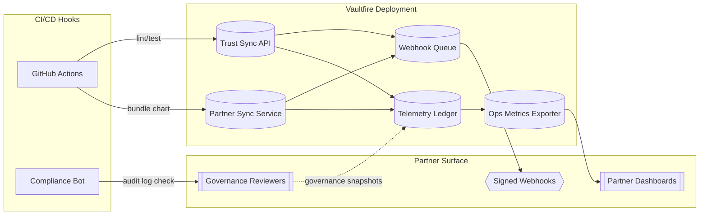

# Vaultfire Protocol 🔥
[](./logs/test-report.json)

[](./docs/badges/trust-badge.svg)

**Belief-secured intelligence for partners who lead with ethics.**

> *"Proof of presence required.
> Watching ain't building.
> Glass breaks. Fire burns."*

---

## Table of Contents
- [Protocol Snapshot](#protocol-snapshot)
- [Mission & Authenticity](#mission--authenticity)
- [Core Pillars](#core-pillars)
  - [Zero-Knowledge Trust Mesh](#zero-knowledge-trust-mesh)
  - [Belief Score Engine](#belief-score-engine)
  - [Drift Anchors](#drift-anchors)
  - [Retro Yield Layer](#retro-yield-layer)
  - [Builder Verification](#builder-verification)
  - [Memory Sync Fabric](#memory-sync-fabric)
- [Simulated Use Case Pilots](#simulated-use-case-pilots)
- [Trust, Transparency & Compliance](#trust-transparency--compliance)
- [Scale Readiness Automation](#scale-readiness-automation)
- [Yield Insights & Retro Streams](#yield-insights--retro-streams)
- [Installation & Quick Start](#installation--quick-start)
- [Operational Playbooks](#operational-playbooks)
  - [Testing Playbook](#testing-playbook)
  - [Module Scope Modes](#module-scope-modes)
  - [How to Launch a Scoped Partner Pilot](#how-to-launch-a-scoped-partner-pilot)
  - [Pilot Integration Timeline](#pilot-integration-timeline)
- [System Diagrams](#system-diagrams)
- [Deployment Guide](#deployment-guide)
- [Partner Integration Modules](#partner-integration-modules)
- [Telemetry Residency & Partner Hooks](#telemetry-residency--partner-hooks)
- [Governance & Risk](#governance--risk)
- [Status & Changelog](#status--changelog)
- [Contributor Identity & Contact](#contributor-identity--contact)
- [Licensing & Legal](#licensing--legal)

---

## Protocol Snapshot
- **Production-hardened:** Vaultfire fuses Codex reasoning engines, NFT identity anchors, and loyalty mechanics into a mission-driven activation stack.
- **Partner-first:** Integration surfaces (CLI, dashboard, APIs) center ethics and provenance for enterprise onboarding.
- **Proof-rich:** Zero-knowledge guards, attested telemetry, and AI mission resonance expose verifiable signals partners can trust.
- **Fork-friendly:** Follows the Moral Memory Fork Agreement (MMFA) so derivatives preserve the Ghostkey ethics lineage.

## Mission & Authenticity
Vaultfire remains a morals-first protocol where every activation must prove alignment before scaling. All case study data is derived from Ghostkey-316 telemetry unless explicitly labeled otherwise.

> **Case Study Reality Check:** Every "deployment" or "case study" in this repository is a sandboxed simulation derived from Ghostkey-316 wallet telemetry until further notice. No commercial trials have shipped beyond the wallet-based pilot layer.

Partners can review the [Live Rollout Readiness Blueprint](./docs/live-rollout-readiness.md) to understand guardian sign-offs, telemetry controls, and switch-flip prerequisites.

## Core Pillars

### Zero-Knowledge Trust Mesh
- `zk_core.py`, `vaultfire/protocol/mission_resonance.py`, and `vaultfire/protocol/constants.py` enforce belief signals through ZK Fog redactions, MPC council coordination, and post-quantum attestations.
- `MissionResonanceEngine` couples confidential ML enclaves with Dilithium-style signatures for mission integrity exports.
- `ConfidentialComputeAttestor` packages remote attestation proofs so partner dashboards verify enclave honesty without exposing payloads.

### Belief Score Engine
- `mirror/engine.js`, `mirror/belief-weight.js`, and `telemetry/belief-log.json` power loyalty-aware scoring with wallet-signed BeliefVote data.
- `BeliefMirrorEngine` streams telemetry into `MultiTierTelemetryLedger` sinks while the dashboard surfaces multipliers, mission resonance, and trust deltas in real time.
- `cli/beliefVote.js` verifies signatures against `proposals.json`, ensuring belief-weighted decisions remain anchored to authenticated contributors.

### Drift Anchors
- Drift anchors enforce covenant continuity by comparing mission baselines with live telemetry.
- `vaultfire/pilot_mode/resonance.py` and `MissionResonanceEngine.resonance_gradient()` highlight mission drift before it escapes guardrails.
- `services/manifestFailover.js` and `services/telemetryTenantRouter.js` keep manifests and telemetry scoped, emitting `manifest.failover.*` events and segregation proofs when anchors detect drift.

### Retro Yield Layer
- `retro_yield.json`, `reward_engine/`, and `docs/gamified_yield_layer.md` define retroactive payouts for belief-aligned contributors.
- `vaultfire_yield_distributor.py` and `yield_pipeline/` simulate reward streams, enabling partners to experiment with retroactive yield before contract deployment.
- Prototype contract [`contracts/RewardStream.sol`](./contracts/RewardStream.sol) manages multiplier updates, while `src/rewards/contractInterface.js` mirrors RPC calls during sandbox validation.

### Builder Verification
- `vaultfire_system_ready.py --attest <wallet>` produces attestations under `attestations/`, logging digests for audits.
- `governance-ledger.json` tracks approvals, and `governance/automation_triggers.py` automates guardrail responses when risk spikes.
- CLI tooling (`vaultfire-cli`, `cli/vaultfire-cli.js`) scaffolds partner configs, trust-sync readiness checks, and ENS-signed belief proofs to validate builder authenticity.

### Memory Sync Fabric
- `beliefSyncService.js`, `ghostloop_sync.py`, and `memory_log.json` synchronize partner memory across belief engines, CLI operations, and dashboard sessions.
- `ghost_loop_monitor.py` and `memory_sync` routines (see `ghostkey_asm_sync.py`) prevent divergence by replaying critical activation loops.
- `alignment_beacon.py` and `alignment_key.py` keep Memory Sync aligned with the mission covenant, ensuring human-first context is retained across modules.

## Simulated Use Case Pilots
All assets are simulation artifacts only. Partners must not treat narratives or metrics as live deployment evidence.
- [Simulated Community XP Pilot](./sim-pilots/community-xp-pilot.md)
- [Simulated Cross-Platform Education Pilot](./sim-pilots/cross-platform-education.md)
- [Simulated Global Retail Loyalty Flow](./sim-pilots/global-retail-loyalty.md)
- [Telemetry & ROI Baseline](./sim-pilots/telemetry-baseline.md)
- [Partner Kit Bundle](./sim-pilots/partner-kit.md)

Live deployments are targeted for the Q4 roadmap. Current examples demonstrate architectural readiness and CLI flow integrity in sandbox environments only.

## Trust, Transparency & Compliance
- **Automated proof:** `npm test` runs Jest with coverage and CLI integrations; artifacts publish on every CI run.
- **Security posture:** Express hardens headers, CORS defaults, and webhook validation while testing JWT and wallet payload regressions.
- **Telemetry ethics:** Wallet-level consent toggles gate Sentry, dashboard renders, and belief vote logging.
- **Sink verification:** `npm run telemetry:verify` hashes telemetry probes in `telemetry/sinks/` and fails fast on checksum drift.
- **Trust badge:** Generated via `node tools/generateCoverageBadge.js` after each successful run.

## Scale Readiness Automation
- `./vaultfire_system_ready.py --attest guardian.eth` provisions mission profiles, alignment simulations, and attestation packs.
- `./vaultfire_system_ready.py --report -` streams readiness JSON for CI archival.
- `./tools/scale_readiness_report.py --pretty` compiles Purposeful Scale decisions, belief-density stats, and attestation freshness.
- Golden environment enforcement lives in `./scripts/check-golden-env.sh`, validating toolchain versions from `configs/golden-environment.json`.

## Yield Insights & Retro Streams
- `python scripts/run_yield_pipeline.py` anonymises mission logs and publishes case studies to `/public/case_studies/`.
- Launch the FastAPI surface with `uvicorn yield_pipeline.api:app --reload` and query `/api/yield-insights?segment_id=belief-01` (rate limited to 30 requests/minute). Optional `date_range=start,end` and `X-API-Key` headers enforce access control.
- `simulate_activation_to_yield` exports retention and referral projections into `/yield_reports/`.
- Every API call appends anonymised evidence to `/attestations/yield-api-activity.json` for compliance.
- `streamlit run dashboard/yield_dashboard.py` visualises ROI, belief segments, and mission drilldowns for partner storytelling.

## Installation & Quick Start
1. **Clone the repository** and install dependencies: `npm install`
2. **Bootstrap environment:** copy `.env.example` (if provided) or export required variables before running services.
3. **Run CLI smoke tests:** `npm run preflight` to validate peer dependencies, Node version, residency configuration, and telemetry guards.
4. **Start partner sync services:**
   - API: `node partnerSync.js`
   - Dashboard dev mode: `npm run dashboard:dev`
   - CLI: `node cli/vaultfire-cli.js <command>` or install globally with `npm install` then `npx vaultfire init`
5. **Launch Mission Resonance tooling:** `python -m vaultfire.protocol.mission_resonance --integrity-report`
6. **Verify telemetry sinks:** `npm run telemetry:verify`

For mobile contexts, run `MOBILE_MODE=true npm run preflight` for a compact readiness summary.

## Operational Playbooks

### Testing Playbook
| Command | Purpose |
| --- | --- |
| `npm test` | Full Jest suite with coverage, regenerating the badge. |
| `MOBILE_MODE=true npm test` | Ensures residency and telemetry guards short-circuit correctly on mobile. |
| `npm run preflight` | Validates dependencies, Node version, and residency configuration. |
| `MOBILE_MODE=true npm run preflight` | Emits the mobile-friendly summary for quick posture checks. |
| `npm run test:coverage` | Optional full instrumentation pass for advanced reporting. |

> **Note:** Python suites covering the async yield pipeline and mission resonance engine require the optional `fastapi` and `cryptography` packages. Install them via `pip install -r requirements.txt` to run the tests instead of skipping.

### Module Scope Modes
Set `VAULTFIRE_MODULE_SCOPE` to load scoped pilot programs. Run `node pilot-loader.js` to verify active modules.

| Scope | Modules Enabled |
| --- | --- |
| `pilot` | CLI, Dashboard, Belief Engine |
| `full` | All services (APIs, Telemetry, Governance) |

When `pilot_mode=true`, the loader defaults to `pilot` scope for minimal rollouts.

### How to Launch a Scoped Partner Pilot
1. Export `VAULTFIRE_SANDBOX_MODE=1` before activating Partner Sync so belief and loyalty engines log to `logs/belief-sandbox.json`.
2. Update `configs/deployment/telemetry.yaml` to toggle telemetry opt-outs (`telemetry.enabled: false` for no-stream pilots).
3. Deploy manifests with `node cli/deployVaultfire.js --env sandbox` to apply pilot-ready toggles across handshake, relay, reward-stream, and telemetry services.
4. Call `GET /status` on the Partner Sync interface and confirm `manifest.semanticVersion`, `ethics.tags`, and `scope.tags` match your pilot scope.
5. Share the pilot brief: reference `VERSION.md`, `/debug/belief-sandbox`, and the README test badge before onboarding contributors.

### Pilot Integration Timeline
| Phase | Window | Partner Checklist |
| --- | --- | --- |
| Discovery Sync | Week 0 | Confirm wallet access, review `manifest.json` ethics tags, capture governance contacts. |
| Sandbox Validation | Week 1 | Enable `logs/belief-sandbox.json`, call `GET /debug/belief-sandbox`, verify telemetry fallbacks through the dashboard API. |
| Governance Review | Week 2 | Share `governance_plan.md`, run `npm test` with the generated `/logs/test-report.json`, archive the latest `CHANGELOG.md`. |
| Pilot Launch | Week 3 | Flip deployment YAMLs with `pilot_ready: true`, rehearse webhooks via SecureStore fallback, distribute due diligence quickstart. |

## System Diagrams
```
┌────────────────────────┐         ┌─────────────────────────────┐
│ Wallet / ENS Identity │─belief─▶│ Partner Sync Interface (API) │
└────────────────────────┘         │  • POST /vaultfire/sync-belief│
                                   │  • GET  /vaultfire/sync-status│
                                   └──────────────┬───────────────┘
                                                  │ real-time socket
                                                  ▼
                                   ┌─────────────────────────────┐
                                   │ Belief Mirror v1 (AI Engine)│
                                   │  • computes multipliers      │
                                   │  • writes telemetry logs     │
                                   └──────────────┬──────────────┘
                                                  │
                                                  ▼
                                   ┌─────────────────────────────┐
                                   │ BeliefVote CLI              │
                                   │  • wallet-signed votes      │
                                   │  • belief-weighted outputs  │
                                   └──────────────┬──────────────┘
                                                  │
                                                  ▼
                                   ┌─────────────────────────────┐
                                   │ Vaultfire Dashboard v1      │
                                   │  • WalletConnect / ENS login│
                                   │  • belief score + history   │
                                   └──────────────┬──────────────┘
                                                  │
                                                  ▼
                                   ┌─────────────────────────────┐
                                   │ Codex Integrity Test Suite  │
                                   │  • audits for alignment     │
                                   └─────────────────────────────┘
```



- **Terraform:** `infra/mvd.tf` provisions AWS Fargate primitives for the Trust Sync API and Partner Sync services.
- **Helm:** `charts/vaultfire/` packages services plus metrics exporters and monitors for Kubernetes clusters.
- **CI/CD Hooks:** GitHub Actions build containers, run Terraform plans, apply Helm releases, and validate `governance/auditLog.json` updates.
- **Metrics Fan-out:** The Ops exporter feeds `/metrics/ops` while `MultiTierTelemetryLedger` streams structured telemetry.

## Deployment Guide
The `deployment/` directory contains minimal Terraform (`vaultfire-minimal.tf`) and a CI-friendly topology diagram (`deployment/deployment-diagram.md`).
1. Run `terraform init` and `terraform plan` to review AWS primitives (artifact bucket, webhook secret).
2. Point CI outputs to the `artifact_bucket` so release bundles land in managed S3 before ECS pulls them.
3. Manage webhook secrets in SSM via `webhook_secret_path` and rotate them using `tools/` automation hooks.
4. Align teams using the provided deployment diagram.

Automation touchpoints stay consistent: GitHub Actions handle tests, the CLI promotes artifacts, and Terraform maintains auditable state.

## Partner Integration Modules
### 🔐 Authentication Layer (`/auth`)
- `tokenService.js` issues JWTs with embedded belief metadata and handles refresh rotation.
- `authMiddleware.js` delivers rate limiting, expiry handling, and RBAC for `admin`, `partner`, and `contributor` personas.
- `expressExample.js` exposes login, refresh, rewards, and belief mirror routes plus Swagger UI at `/docs`.
- **Run locally:** `npm run start:api`

### 🧠 Ethics Protocol Guardrails (`/middleware`)
- `ethicsGuard.js` logs intent metadata to `logs/ethics-guard.log` and enforces block/warn policies.
- Extend via `middleware/guardrail-policy.json` or swap in custom policy files.
- Automation spikes raise alerts aligned with Vaultfire’s ethics doctrine.

### 🧩 Partner Onboarding Kit (`/cli`)
- `vaultfire-cli` streamlines setup:
  - `vaultfire init` scaffolds `vaultfire.partner.config.json` and belief templates.
  - `vaultfire test` pings `/health` to verify connectivity and auth readiness.
  - `vaultfire push` submits belief telemetry (`--beliefproof` emits ENS-signed hashes).
  - `vaultfire trust-sync` verifies maturity, reporting fingerprinted timelines and uptime multipliers.
- Install globally via `npm install` then `npx vaultfire init`, or run locally with `node cli/vaultfire-cli.js <command>`.

### 🌐 Partner Dashboard (`/dashboard`)
- React + Vite interface with JWT-gated access, yield metrics, and belief telemetry visualisations.
- Shares the same APIs as the CLI for consistent flows.
- **Develop:** `npm run dashboard:dev`
- **Build:** `npm run dashboard:build`

### 🧾 OpenAPI & Compliance Artifacts
- `docs/vaultfire-openapi.yaml` mirrors endpoints described in `vaultfire-partner-docs/docs/api-reference.md`.
- `vaultfire-sla.json` tracks uptime, response SLAs, and ethics obligations.
- `vaultfire-compliance-template.json` provides a ready-to-complete privacy and telemetry checklist.

### ✅ Testing & Coverage
- Jest suites in `/tests` cover authentication, guardrail middleware, CLI scaffolding, and telemetry routing.
- Run `npm test` or `npm run test:coverage` to validate.
- `codex-integrity.json` records pass/fail metadata for audit trails.

## Telemetry Residency & Partner Hooks
- Configure residency policies in `vaultfirerc.json` (override with `VAULTFIRE_RC_PATH`). Enable `"telemetry-fallback": true` to mirror remote sink failures into `logs/telemetry/remote-fallback.jsonl`.
- Residency guardrails require Sentry DSNs and partner webhooks to match allow-lists defined in `trustSync.telemetry.residency`.
- `services/telemetryTenantRouter.js` segregates logs per partner and supports burst drains via `flushAll()`.
- Sample hook adapter:
  ```js
  const partnerHook = require('./telemetry/adapters/partner_hook_adapter');

  partnerHook.init('https://partners.example.com/hooks/telemetry');
  await partnerHook.writeTelemetry({ event: 'belief.signal', payload: { wallet: '0xabc' } });
  ```
- Swap URLs for regional endpoints to respect residency constraints while tapping into belief events.

**Final Rule: Wallet is passport. Vaultfire never compromises.**

## Governance & Risk
- Critical decisions live in [`governance-ledger.json`](./governance-ledger.json) with workflow docs in [`governance/README.md`](./governance/README.md).
- Use `npm run audit:gov` to validate ledger updates before merging.
- Cross-reference ledger changes with telemetry metrics (`docs/metrics.md`) and posture rotation logs for due diligence packets.
- Risk automation hooks raise guardrail actions when queues spike, security alerts trigger, or ethics overrides require steward review.

## Status & Changelog
- **Activation:** Complete and operational across the Vaultfire network.
- **Versioning:** Semantic versioning tracked in [`VERSION.md`](./VERSION.md) and surfaced through `manifest.json`.
- **Stability:** Production-ready with partner integrations, continuous monitoring, and ethics-first guardrails.
- **Latest release:** v1.4.0 (2024-09-12) introduced sandbox metrics, manifest metadata, telemetry safeguards, and pilot-ready toggles. Full details live in `VERSION.md`.

## Contributor Identity & Contact
- **Architect:** Ghostkey-316
- **ENS:** `ghostkey316.eth`
- **Primary Wallet:** `bpow20.cb.id`

Prospective partners can initiate integration via the onboarding toolkit, schedule a Codex handshake session, or contact Ghostkey-316 through verified ENS or wallet messaging. Support includes activation workshops, SDK walkthroughs, and ethics alignment audits.

## Licensing & Legal
Vaultfire is released under a morals-first framework that permits fair-use collaboration, prohibits exploitative deployments, and requires operators to preserve ethics alignment, attribution, and user consent. No medical, legal, or financial advice is provided; partners must complete their own compliance reviews prior to launch. Partnerships are fully supported, integration examples run in production, and system logs may store limited personal data for reflective analysis. Plugin support is provided as-is, derivative forks must retain the Ghostkey Ethics framework, commercial rights require an opt-in beacon tag, and all forks must reference the original Vaultfire URI.

---
**Architect:** Ghostkey-316 · Vaultfire Protocol Steward
