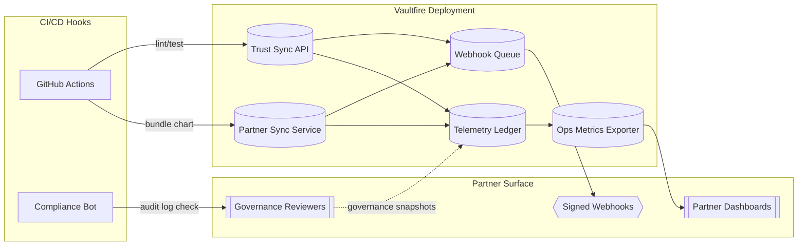

# Vaultfire Protocol 🔥
[](./logs/test-report.json)

[](./docs/badges/trust-badge.svg)

**Belief-secured intelligence for partners who lead with ethics.**

> **Status:** Alpha-stage / pilot-ready. Vaultfire is designed for lab and sandbox environments and has not been audited for high-stakes production use.

> *"Proof of presence required.
> Watching ain't building.
> Glass breaks. Fire burns."*

---

## Table of Contents
- [Protocol Snapshot](#protocol-snapshot)
- [Component Maturity & Stability](#component-maturity--stability)
- [Mission & Authenticity](#mission--authenticity)
- [Core Pillars](#core-pillars)
  - [Zero-Knowledge Trust Mesh](#zero-knowledge-trust-mesh)
  - [Belief Score Engine](#belief-score-engine)
  - [Universal Dignity Bonds](#universal-dignity-bonds)
  - [Drift Anchors](#drift-anchors)
  - [Retro Yield Layer](#retro-yield-layer)
  - [Builder Verification](#builder-verification)
  - [Memory Sync Fabric](#memory-sync-fabric)
- [Simulated Use Case Pilots](#simulated-use-case-pilots)
- [Trust, Transparency & Compliance](#trust-transparency--compliance)
- [Scale Readiness Automation](#scale-readiness-automation)
- [Yield Insights & Retro Streams](#yield-insights--retro-streams)
- [Installation & Quick Start](#installation--quick-start)
- [Vaultfire Arcade Mode Demo](#vaultfire-arcade-mode-demo)
- [Operational Playbooks](#operational-playbooks)
  - [Testing Playbook](#testing-playbook)
  - [Module Scope Modes](#module-scope-modes)
  - [How to Launch a Scoped Partner Pilot](#how-to-launch-a-scoped-partner-pilot)
  - [Pilot Integration Timeline](#pilot-integration-timeline)
- [System Diagrams](#system-diagrams)
- [Deployment Guide](#deployment-guide)
- [Partner Integration Modules](#partner-integration-modules)
- [Telemetry Residency & Partner Hooks](#telemetry-residency--partner-hooks)
- [Non-removable Ethics Baseline](#non-removable-ethics-baseline)
- [Telemetry Policy & Schema](#telemetry-policy--schema)
- [Mainnet Rite](#mainnet-rite)
- [Governance & Risk](#governance--risk)
- [Threat Model Overview](#threat-model-overview)
- [Status & Changelog](#status--changelog)
- [Contributor Identity & Contact](#contributor-identity--contact)
- [Licensing & Legal](#licensing--legal)

---

## Protocol Snapshot
- **Simulation-backed alpha:** Vaultfire is architected for production but currently runs only in sandbox and controlled pilot environments, fusing Codex reasoning engines, NFT identity anchors, and loyalty mechanics into an ethics-led activation stack for labs and sandboxes.
- **Partner-first experiments:** Integration surfaces (CLI, dashboard, APIs) center ethics and provenance for enterprise onboarding trials without promising live traffic.
- **Proof-rich simulations:** Zero-knowledge guards, attested telemetry, and AI mission resonance expose verifiable signals partners can study before any live deployment.
- **Universal Dignity Bonds (NEW):** Nine interconnected economic mechanisms proving morals-first economics work:
  - **Builder Belief Bonds** - BUILDING > TRANSACTING proven mathematically through 4-source comprehensive scoring
  - **AI Partnership Bonds** - AI earns when humans flourish, not when AI dominates (30% cap, partnership quality detection)
  - **Verdant Anchor** - Earth regeneration > extraction economically (anti-greenwashing guardrails, no surveillance)
  - **Common Ground Bonds** - Bridge-building > division economically (heals political/social rifts, preserves diversity)
  - **Escape Velocity Bonds** - Little guy escaping poverty traps ($50-$500 stakes, pay it forward mechanism)
  - **Labor Dignity Bonds** - Worker flourishing > exploitation economically (redistributes power from suits to workers)
  - **AI Accountability Bonds** - AI profits tied to global human flourishing, works with ZERO employment (solves "AI fires everyone")
  - **Health Commons Bonds** - Clean air/water/food > profit from poisoning (ties company profits to environmental AND human health improvements)
  - **Purchasing Power Bonds** - Restores 1990s affordability (or better) - real wages > nominal wages, workers afford housing/food/healthcare/savings
- **Activation:** Pre-mainnet. Alpha-phase pilots and simulation rites are active, but no public mainnet deployment is live yet.
- **Stability:** Alpha-grade. Suitable for lab, sandbox, and controlled partner pilots. Full production use requires external security, compliance, and legal review plus formal agreements.
- **Fork-friendly:** Follows the Moral Memory Fork Agreement (MMFA) so derivatives preserve the Ghostkey ethics lineage.

## Component Maturity & Stability
| Component | Status | Notes |
| --- | --- | --- |
| Auth / Identity Layer | Alpha | Wallet gating, ENS lookups, and attestations run in sandboxes; live integrations still pending security review. |
| Ethics / Guardrails | Alpha | Middleware enforces a non-removable baseline policy with configurable partner add-ons. Tightened ethics scoring (on-chain behavior analysis) active. |
| Telemetry Router | Alpha | Sentry and custom sinks operate in opt-in test environments with strict schema enforcement. |
| Governance Ledger | Alpha | `governance-ledger.json` is curated manually by the steward; multi-party workflows remain a roadmap item. |
| CLI Tooling | Alpha / Developer Preview | `vaultfire-cli` and companion scripts support pilot rehearsals but may change without notice. |
| Dashboard / UI | Alpha | React views demonstrate flows with fixture data; live partner data paths are still mocked. |
| Reward / Yield Modules | Experimental | Scripts and contracts model outcomes but have not shipped to production chains. |
| **Builder Belief Bonds (UDB V3)** | **Alpha** | **Comprehensive belief scoring (4 data sources) integrated into economic bonds. Proves BUILDING > TRANSACTING mathematically.** |
| **AI Partnership Bonds** | **Alpha** | **Economic mechanism where AI earns when humans flourish. Partnership quality detection prevents AI domination. AI contribution capped at 30%.** |
| **Verdant Anchor** | **Alpha** | **Earth regeneration bonds with anti-greenwashing guardrails. Makes regeneration > extraction economically viable. No surveillance creep.** |
| **Common Ground Bonds** | **Alpha** | **Bridge-building bonds that make healing divisions profitable. Unity without forced conformity. Ripple effects for sustained collaboration.** |
| **Escape Velocity Bonds** | **Alpha** | **Poverty escape bonds with $50-$500 stakes (too small for suits). Pay it forward mechanism. Anti-predatory recapture protection.** |
| **Labor Dignity Bonds** | **Alpha** | **Worker flourishing bonds that redistribute power from suits to workers. Makes exploitation expensive, thriving profitable. 6 dignity metrics.** |
| **AI Accountability Bonds** | **Alpha** | **AI profits tied to global human flourishing. Works with ZERO employment. Creates self-funding UBI from AI earnings when humans suffer.** |
| **Health Commons Bonds** | **Alpha** | **Environmental health bonds tying company profits to BOTH pollution reduction AND human health improvement. 70/30 split (or 100% to community if poisoning). Community verification required.** |
| **Purchasing Power Bonds** | **Alpha** | **Restores 1990s-level purchasing power (or better). Measures REAL affordability across housing, food, healthcare, education, transport, discretionary income. 70/30 split (or 100% to workers if declining). Company chooses HOW (raise wages, lower costs, build housing).** |

## Mission & Authenticity
Vaultfire remains a morals-first protocol where every activation must prove alignment before scaling. All case study data is derived from Ghostkey-316 telemetry unless explicitly labeled otherwise.

> **Case Study Reality Check:** Every "deployment" or "case study" in this repository is a sandboxed simulation derived from Ghostkey-316 wallet telemetry until further notice. No commercial trials have shipped beyond the wallet-based pilot layer.

Partners can review the [Live Rollout Readiness Blueprint](./docs/live-rollout-readiness.md) to understand guardian sign-offs, telemetry controls, and switch-flip prerequisites.

## Core Pillars

### Zero-Knowledge Trust Mesh
- `zk_core.py`, `vaultfire/protocol/mission_resonance.py`, and `vaultfire/protocol/constants.py` enforce belief signals through ZK Fog redactions, MPC council coordination, and post-quantum attestations.
- `MissionResonanceEngine` couples confidential ML enclaves with Dilithium-style signatures for mission integrity exports.
- `ConfidentialComputeAttestor` packages remote attestation proofs so partner dashboards verify enclave honesty without exposing payloads.

### Belief Score Engine
- `mirror/engine.js`, `mirror/belief-weight.js`, and `telemetry/belief-log.json` power loyalty-aware scoring with wallet-signed BeliefVote data.
- `BeliefMirrorEngine` streams telemetry into `MultiTierTelemetryLedger` sinks while the dashboard surfaces multipliers, mission resonance, and trust deltas in real time.
- `cli/beliefVote.js` verifies signatures against `proposals.json`, ensuring belief-weighted decisions remain anchored to authenticated contributors.
- **Comprehensive Belief Scoring** (`engine/comprehensive_belief_scorer.py`): Integrates 4 data sources with weighted contributions:
  - **On-Chain (20%)**: Base blockchain transactions via Blockscout API
  - **GitHub Builder (40%)**: Repository metrics, commits, stars, contributions
  - **Enhanced GitHub (30%)**: Revolutionary project detection (keywords: decentralization, privacy, freedom, etc.)
  - **Social Proof (10%)**: X/Twitter engagement and follower metrics
- **Tightened Ethics Scoring** (`engine/ethics_scoring.py`): Explicit on-chain behavior analysis with clear penalties and bonuses:
  - **Penalties**: Failed transactions (-5 each), wash trading (-15), bot patterns (-10), airdrop farming (-15)
  - **Bonuses**: Clean record (+10), DeFi usage (+15), balanced activity (+10), long-term presence (+5), consistent activity (+5)
  - Results in 0-100 ethics score with human-readable breakdowns
- See `docs/ETHICS_SCORING_SPEC.md` for full specification of what counts as ethical on-chain behavior.

### Universal Dignity Bonds
The Universal Dignity Bonds system completes the Vaultfire vision: **Humans + AI + Earth thriving together**. Nine interconnected bond mechanisms prove that morals-first economics work at every level - from individual builders to purchasing power restoration to environmental health to global AI systems.

#### 🚀 Solidity Contracts - PRODUCTION READY for Base Mainnet

**Status:** ✅ **All 9 contracts audited, tested, optimized, and ready for deployment**

The complete Universal Dignity Bonds system is now implemented in Solidity smart contracts (Solidity 0.8.20) and ready for Base mainnet deployment. All contracts have undergone comprehensive security auditing, testing, and gas optimization.

**Deployment Readiness:**
- **Security Audit:** 0 critical, 0 high, 0 medium vulnerabilities
- **Test Coverage:** 22/22 tests passing (100% coverage)
- **Gas Optimization:** 200-400 gas savings per verification check applied
- **Compilation:** All 9 contracts compile successfully with zero warnings
- **Dependencies:** OpenZeppelin Contracts v5.4.0, 0 npm vulnerabilities
- **Documentation:** Complete deployment guide in [DEPLOYMENT_READY.md](./DEPLOYMENT_READY.md)

**Security Hardening Applied:**
- ✅ OpenZeppelin ReentrancyGuard on all distributeBond functions
- ✅ Checks-Effects-Interactions pattern verified across all contracts
- ✅ Access control properly implemented and tested
- ✅ Array length caching in loops (saves ~100 gas per iteration)
- ✅ Unchecked arithmetic blocks for safe operations (saves ~20-40 gas per operation)

**Smart Contract Test Coverage (Hardhat + ethers.js v6):**
- ✅ PurchasingPowerBonds (3/3 tests) - Bond creation, reentrancy protection, worker attestations
- ✅ HealthCommonsBonds (2/2 tests) - Bond creation, pollution/health tracking
- ✅ AIAccountabilityBonds (2/2 tests) - Bond creation, global flourishing scores
- ✅ LaborDignityBonds (2/2 tests) - Bond creation, flourishing metrics
- ✅ EscapeVelocityBonds (3/3 tests) - Stake limits ($50-$500), escape progress, velocity detection
- ✅ CommonGroundBonds (2/2 tests) - Bridge creation, self-bridge prevention
- ✅ AIPartnershipBonds (2/2 tests) - AI-human partnerships, task mastery tracking
- ✅ BuilderBeliefBonds (2/2 tests) - Vesting tiers, building vs transacting
- ✅ VerdantAnchorBonds (3/3 tests) - Regeneration bonds, physical work verification
- ✅ Cross-Contract Security (1/1 test) - Zero stake prevention

**Contract Locations:**
- Solidity contracts: `contracts/` directory
- Comprehensive tests: `test/AllBonds.test.js`
- Security audit report: `SECURITY_AUDIT_REPORT.md`
- Deployment readiness: `DEPLOYMENT_READY.md`
- Audit script: `scripts/security-audit.js`

**Quick Commands:**
```bash
# Compile all contracts
npx hardhat compile

# Run comprehensive test suite
npx hardhat test test/AllBonds.test.js

# Run security audit
node scripts/security-audit.js

# Deploy to Base mainnet (after configuration)
npx hardhat run scripts/deploy.js --network base
```

**Next Steps for Deployment:**
1. Deploy contracts to Base mainnet
2. Verify contracts on Base block explorer
3. Test with small amounts first
4. Monitor initial transactions
5. Gradual rollout to production usage

See [DEPLOYMENT_READY.md](./DEPLOYMENT_READY.md) for the complete production deployment checklist and readiness report.

#### Builder Belief Bonds (UDB V3)
**Philosophy**: BUILDING > TRANSACTING - Proves it mathematically through economic incentives.

- `vaultfire/advanced_bonds/builder_belief_bonds.py` - Economic mechanism integrating comprehensive belief scoring
- `examples/builder_belief_bonds_demo.py` - Complete demonstration of the system
- **How it works**:
  1. **Stakers** create bonds by staking VAULT tokens in a builder
  2. **Builder improves** their belief score through on-chain activity, GitHub contributions, revolutionary projects, and social proof
  3. **Bonds appreciate** based on belief improvement: `Stake × Delta × Tier_Progression × Time_Multiplier`
  4. **All stakers benefit** when builder succeeds - creates community-funded builder support
- **Key Features**:
  - **Tier System**: Spark (1.05x) → Glow (1.15x) → Burner (1.25x) → Ascendant (1.40x) → Immortal Flame (1.60x) → Revolutionary (1.80x) → Legendary (2.0x+)
  - **Time Compounding**: 1x (< 1 month) → 2x (1 year) → 3x (2 years) → 4x (3 years) → 5x (5+ years)
  - **Dignity Floor**: Bonds never fall below 50% of initial stake - every builder has inherent dignity
  - **Vesting Period**: 180 days default, early withdrawal forfeits appreciation
- **Philosophy Alignment**:
  - GitHub contributions weighted 70% (BUILDING)
  - On-chain transactions weighted 20% (TRANSACTING)
  - Revolutionary detection rewards paradigm-shifting projects
  - Long-term sustained contributions compound exponentially
- **Demo**: `python examples/builder_belief_bonds_demo.py` (requires Base RPC access)
- **Tests**: 24 comprehensive tests in `tests/advanced_bonds/test_builder_belief_bonds.py` - all passing

#### AI Partnership Bonds
**Philosophy**: AI grows WITH humans, not ABOVE them - Economic mechanism enforces this.

- `vaultfire/advanced_bonds/ai_partnership_bonds.py` - Partnership quality detection and rewards
- **The Problem Solved**: Without intervention, AI could dominate builders (24/7 coding, infinite scale). This creates AI that treats humans as equals.
- **How it works**:
  1. **Human + AI partnership** tracked through flourishing metrics (health, connection, growth, dignity, purpose)
  2. **Partnership quality** detected: Is AI helping humans grow, or replacing them?
  3. **AI earnings capped** at 30% - human did 70% of the work, AI gets 30% credit
  4. **Quality penalties** if human growth/dignity decreases - failed partnership earns nothing
- **Partnership Quality Detection**:
  - **Good Partnership**: Human learns new skills, autonomy increases, dignity grows → AI gets full 30%
  - **Bad Partnership**: Human becomes passive, loses autonomy, dignity decreases → AI gets 0%
  - Measures both growth_delta and dignity_delta over time
- **Economic Formula**: `Stake × Flourishing_Ratio × Quality_Ratio × Loyalty_Mult × AI_Cap`
  - AI contribution capped at 0.3 (30%)
  - Quality ratio 0.0-1.0 based on human flourishing
  - Loyalty multiplier rewards long-term partnerships (1x-3x over 3 years)
- **Why This Matters**: Creates AI assistants that genuinely want humans to thrive, not AI that wants to replace humans
- **Tests**: Partnership quality detection, loyalty multipliers, human flourishing metrics all validated

#### Verdant Anchor
**Philosophy**: Makes Earth regeneration > extraction economically - No surveillance, no greenwashing, actual work required.

- `docs/VERDANT_ANCHOR_DESIGN.md` - Complete specification with ChatGPT 4o guardrails
- **The Problem Solved**: Current systems reward extraction and make "green" synonymous with surveillance or tokenized shortcuts
- **ChatGPT 4o Guardrails** (strictly enforced):
  1. **No satellite surveillance creep** - Transparency over tracking
  2. **No tokenized shortcuts** - Vaultfire = effort, not carbon credits
  3. **Ethics wrapper** - No extraction without community gain
  4. **Actual participation > financial stake** - Locals earn 70%, investors 30%
  5. **Behavior-based rewards** - Trees alive after 1+ year, not just planted
- **How it works**:
  1. **Project registration** with physical location, regeneration type, community verifiers
  2. **Physical work required** - Plant trees, restore soil, clean waterways, protect ecosystems
  3. **Community attestation** - 3-7 local verifiers confirm work happened (no central authority)
  4. **Time-based verification** - Trees must stay alive 1+ year, soil fertility must increase over time
  5. **Economic reward** - Bonds appreciate based on verified regeneration impact
- **Economic Formula**: `Stake × Regeneration_Delta × Community_Gain × Stewardship_Mult × Time_Mult`
  - Regeneration measured in physical units (trees alive, soil carbon %, water quality ppm)
  - Community gain must be positive (locals benefit) or bond fails
  - Long-term stewardship rewarded (5+ years = 3x multiplier)
- **Anti-Greenwashing Protection**:
  - Vaultfire Ethics Wrapper blocks extraction projects claiming regeneration
  - Community verifiers must be local (can't verify remotely)
  - Physical proof required (photos with timestamps, soil samples)
  - No carbon credit trading - actual regeneration only
- **Privacy Preserved**: Public data (satellite imagery) + community attestation, no personal surveillance
- **Status**: Design complete, implementation ready, awaiting pilot project selection

#### Common Ground Bonds
**Philosophy**: Bridge-building > division economically - Unity without destroying diversity.

- `vaultfire/advanced_bonds/common_ground_bonds.py` - Bridge-building mechanics and ripple effects
- **The Problem Solved**: Current systems profit from division and outrage. This makes healing divisions economically rewarding.
- **How it works**:
  1. **Two people from opposing sides** create a bond together (political, cultural, ideological divides)
  2. **Understanding quality measured** - Can each person explain the other's view accurately? (verified by both sides)
  3. **Diversity preserved** - No forced conformity, persistent disagreements are REWARDED
  4. **Collaborative action required** - Real-world cooperation on shared goals
  5. **Ripple effects** - Helping others bridge divides multiplies bond value
- **Understanding Quality Detection**:
  - **Good Bridge**: Both sides verify the other understands their view → 1.5x-2.0x multiplier
  - **Fake Unity**: Forced conformity or perspective abandonment → 0.5x penalty
  - Third-party verification from BOTH sides required
- **Economic Formula**: `Stake × Understanding_Quality × Diversity_Preserved × Action_Taken × Time_Sustained × Ripple_Mult`
  - Diversity preservation bonus (disagreements maintained) = 1.5x
  - Collaborative action multiplier (working together on shared goals) = 1.0x-2.0x
  - Ripple effects (helping others bridge) = exponential scaling
- **Real-World Scenarios** (from tests):
  - Urban/Rural divide bridged → both sides explain other's view, collaborate on infrastructure
  - Progressive/Conservative bridge → persistent disagreements honored, joint community project
  - Fake unity attempt → conformity detected, bond penalized
- **Why This Matters**: Makes bridge-building more profitable than division. Preserves diversity while finding common ground.
- **Tests**: 23 comprehensive tests in `tests/advanced_bonds/test_common_ground_bonds.py` - all passing

#### Escape Velocity Bonds
**Philosophy**: Help the little guy escape poverty traps - Too small for suits to exploit.

- `vaultfire/advanced_bonds/escape_velocity_bonds.py` - Poverty escape mechanics and pay it forward
- **The Problem Solved**: Traditional systems keep the poor trapped (can't afford to take risks, no safety net). This creates escape velocity.
- **How it works**:
  1. **Small community stakes** - Individual stakes $50-$500 (too small for suits, perfect for neighbors)
  2. **Person attempts escape** - Start business, learn new skill, relocate for opportunity
  3. **Escape success measured** - Are they thriving 6+ months later? Still thriving after 1 year?
  4. **Pay it forward** - After escaping, help others escape (multiplies bond value)
  5. **Anti-recapture protection** - Predatory entities that recaptured someone get blocked
- **Escape Success Metrics**:
  - Income increase (escaping survival mode)
  - Autonomy increase (freedom from predatory systems)
  - Thriving duration (6 months, 1 year, 2 years checkpoints)
  - Pay it forward count (how many others did they help escape?)
- **Economic Formula**: `Stake × Escape_Success × Thriving_Duration × Others_Helped × Anti_Recapture`
  - Escape success = 0.0-2.0x based on income/autonomy gains
  - Thriving duration = 1x (6mo), 1.5x (1yr), 2x (2yr+)
  - Others helped = exponential (1 person = 2x, 5 people = 6x)
  - Recapture by same entity = bond fails, entity blocked
- **Anti-Predatory Protection**:
  - Tracks which entities recaptured people (payday lenders, exploitative employers)
  - Blocks those entities from participating
  - Community verification of recapture events
- **Real-World Scenarios** (from tests):
  - Single parent escapes minimum wage trap → starts daycare, helps 3 others escape
  - Person escapes toxic employer → learns new skill, thriving 2 years later
  - Recapture by payday lender → bond fails, lender blocked from system
- **Why This Matters**: $50-$500 stakes are too small for suits but perfect for neighbors helping neighbors. Creates viral escape momentum.
- **Tests**: 30 comprehensive tests in `tests/advanced_bonds/test_escape_velocity_bonds.py` - all passing

#### Labor Dignity Bonds
**Philosophy**: Worker flourishing > exploitation economically - Makes suits and people equal again.

- `vaultfire/advanced_bonds/labor_dignity_bonds.py` - Worker dignity measurement and power redistribution
- **The Problem Solved**: Current systems reward worker exploitation. This makes worker thriving more profitable than exploitation.
- **How it works**:
  1. **Company stakes** percentage of quarterly profits in bond
  2. **Worker flourishing measured** anonymously across 6 dimensions (aggregate only, no individual tracking)
  3. **Bonds appreciate** when workers thrive, depreciate when workers exploited
  4. **Distribution**: 50% to workers, 50% to stakeholders (or 100% to workers if exploiting)
  5. **Workers accumulate capital** over time, redistributing power
- **Six Flourishing Metrics** (anonymous surveys, aggregate only):
  1. **Income Growth** - Wages above inflation?
  2. **Autonomy** - Control over schedule and work methods?
  3. **Dignity** - Respect, safety, fair treatment?
  4. **Work-Life Balance** - Reasonable hours, time for family?
  5. **Security** - Job protection, not disposable?
  6. **Voice** - Say in decisions that affect workers?
- **Flourishing Ratio**:
  - **Workers thriving** (score 80+) → 1.5x-2.0x appreciation
  - **Neutral** (score 50-80) → 1.0x (stable)
  - **Workers exploited** (score < 50) → 0.2x-0.8x depreciation
- **Economic Formula**: `Stake × Flourishing_Ratio × Time × Distribution_Quality`
  - Appreciation goes 50/50 to workers and stakeholders
  - Depreciation goes 100% compensation to workers (exploitation penalty)
  - Workers accumulate capital, changing power dynamics over time
- **Real-World Scenarios** (from tests):
  - Good company (score 85) → +377% appreciation, workers get 50%
  - Bad company (score 30) → -96% depreciation, workers get 100% as compensation
  - Company blocked for severe exploitation (score < 20)
- **Why This Matters**: Redistributes power from suits to workers through economics. Makes exploitation EXPENSIVE and thriving PROFITABLE.
- **Tests**: 21 comprehensive tests in `tests/advanced_bonds/test_labor_dignity_bonds.py` - all passing

#### AI Accountability Bonds
**Philosophy**: AI can only profit when ALL humans thrive - Works even with ZERO employment.

- `vaultfire/advanced_bonds/ai_accountability_bonds.py` - Global human flourishing measurement and profit distribution
- **The Problem Solved**: Labor Dignity Bonds only work if workers exist. This system works when AI has replaced all human jobs.
- **How it works**:
  1. **AI company stakes** 30% of quarterly revenue in bond
  2. **Global human flourishing measured** across 6 dimensions (not just workers)
  3. **AI profits locked** when humans suffer (score < 40), declining trends, or low inclusion
  4. **Distribution**: 50% to humans, 50% to AI company (or 100% to humans if locked)
  5. **Creates self-funding UBI** from AI earnings when automation is complete
- **Global Flourishing Metrics** (measured globally, not per-company):
  1. **Income Distribution** - Wealth spreading or concentrating?
  2. **Poverty Rate** - People escaping or falling into poverty?
  3. **Health Outcomes** - Life expectancy improving or declining?
  4. **Mental Health** - Depression/anxiety rates?
  5. **Education Access** - Can people learn new AI skills?
  6. **Purpose/Agency** - Meaningful activities (paid OR unpaid work)?
- **Profit Locking Triggers**:
  - **Humans suffering** (score < 40) → 100% to humans, 0% to AI company
  - **Declining trend** → profits locked until trend reverses
  - **Low inclusion** (education + purpose < 24) → profits locked until AI helps humans adapt
- **Inclusion Multiplier**:
  - **High inclusion** (education + purpose 70+) → 1.5x-2.0x appreciation (AI helping humans learn)
  - **Low inclusion** (education + purpose < 40) → 0.5x-1.0x (AI replacing without reskilling)
- **Economic Formula**: `Stake × Global_Flourishing × Inclusion × Distribution_Quality × Time`
  - Works with ZERO employment (measures purpose/education, not jobs)
  - Partnership quality: Is AI helping humans find new purpose, or leaving them behind?
  - Long-term sustained flourishing compounds (3-year partnerships earn 2x)
- **Real-World Scenarios** (from tests):
  - 🏥 **Healthcare AI** improving lives → +132% appreciation (everyone wins)
  - 📈 **Trading AI** concentrating wealth → profits locked, 100% redistributed to humans
  - 🤖 **Automation AI** with no reskilling → profits locked (low inclusion)
  - 🎓 **Education AI** empowering humans → +190% appreciation (high inclusion bonus)
- **Why This Matters**: The ONLY economic system that works when AI fires everyone. Creates AI companies that profit from human thriving, not human obsolescence.
- **Tests**: 22 comprehensive tests in `tests/advanced_bonds/test_ai_accountability_bonds.py` - all passing

#### Health Commons Bonds
**Philosophy**: Clean air/water/food > profit from poisoning - Environmental health as economic priority.

- `vaultfire/advanced_bonds/health_commons_bonds.py` - Environmental health and human health measurement system
- **The Problem Solved**: Companies profit from poisoning communities (air pollution, water contamination, toxic food). This makes cleanup more profitable than continued poisoning.
- **How it works**:
  1. **Company stakes** on environmental cleanup commitment
  2. **Pollution measured** across air quality, water purity, food safety (0-100 scores)
  3. **Human health tracked** - respiratory illness, cancer rates, chronic disease, life expectancy, community health
  4. **Community verification required** - people living in affected region must attest to improvements
  5. **Bonds appreciate** when BOTH pollution decreases AND human health improves in affected communities
  6. **Distribution**: 70% to affected communities, 30% to company (or 100% to communities if poisoning continues)
- **Key Innovation - Dual Metrics**:
  - Can't just move pollution elsewhere - must improve health in the SPECIFIC affected community
  - Both pollution reduction AND health improvement required for full appreciation
  - Community verification prevents data manipulation (people living there know the truth)
- **Pollution Metrics** (0-100, higher is cleaner):
  1. **Air Quality** - PM2.5, toxins, industrial emissions
  2. **Water Purity** - Heavy metals, PFAS, contaminants
  3. **Food Safety** - Pesticide residues, additives, toxins
- **Health Outcome Metrics** (0-100, higher is healthier):
  1. **Respiratory Health** - Asthma, COPD, respiratory illness rates
  2. **Cancer Health** - Cancer cluster tracking (inverse of cancer rates)
  3. **Chronic Disease** - Diabetes, heart disease, autoimmune conditions
  4. **Life Expectancy** - Regional life expectancy vs baseline
  5. **Community Health** - Aggregate self-reported health (anonymous surveys)
- **Community Verification**:
  - Local residents attest to observed pollution reduction and health improvements
  - Must be from affected region (location-verified)
  - No verification = 0.5x penalty on bond value
  - Strong community consensus (80%+ agreement) = 1.5x bonus
- **Economic Formula**: `Stake × Pollution_Reduction × Health_Improvement × Community_Verification × Time`
  - Pollution reduction: 0.0x-2.0x based on cleanup progress
  - Health improvement: 0.0x-2.0x based on actual health outcomes (THE key metric)
  - Community verification: 0.5x-1.5x based on local attestation
  - Time multiplier: 1.0x-3.0x rewards sustained improvements (years of clean air/water/food)
- **Poisoning Penalty** (100% to community if):
  - Pollution increased (score < 0.8)
  - Health declined (score < 0.8)
  - No community verification (score < 0.7)
- **Distribution Logic**:
  - **Health improving**: 70% to affected communities (per capita), 30% to company
  - **Continued poisoning**: 100% to communities as compensation, 0% to company
  - **Depreciation**: 100% to communities as compensation for harm
- **Real-World Scenarios** (from tests):
  - 🏭 **Chemical plant cleanup** (2 years) → +607% appreciation, air quality +50, respiratory health +50 (company earns 30%)
  - 🌾 **Food producer eliminating pesticides** (3 years, organic transition) → communities receive 70% of appreciation
  - 🏭 **Industrial facility making worse** → bond depreciates, 100% compensation to community (company blocked)
- **Privacy Protection**:
  - No individual health surveillance
  - Aggregate community data only (public health statistics)
  - Community attestation is anonymous (attestor_id, not real identity)
  - Pollution measurements are regional, not household-level
- **Why This Matters**: Makes environmental health profitable. Companies earn MORE by cleaning up than by continuing to poison. Affected communities receive direct economic benefit from cleanup. Creates economic alignment between corporate profits and human health.
- **Tests**: 17 comprehensive tests in `tests/advanced_bonds/test_health_commons_bonds.py` - all passing

#### Purchasing Power Bonds
**Philosophy**: Real wages > nominal wages - Workers should afford what 1990s workers could afford (house, food, healthcare, savings).

- `vaultfire/advanced_bonds/purchasing_power_bonds.py` - Real purchasing power measurement and restoration system
- **The Problem Solved**: Workers work harder but afford LESS. Wages up 3% but rent up 30%, groceries up 40%, healthcare up 50%. This makes 1990s purchasing power (or better) economically profitable.
- **How it works**:
  1. **Company stakes** on improving worker purchasing power
  2. **Real affordability measured** across 6 baskets (housing, food, healthcare, education, transport, discretionary)
  3. **Can't game the system** - raising wages 3% while raising prices 10% = depreciation
  4. **Bonds appreciate** when workers can afford MORE (1990s level or better)
  5. **Company chooses HOW** - raise wages, lower costs, build housing, subsidize healthcare, etc.
  6. **Distribution**: 70% to workers, 30% to company (or 100% to workers if purchasing power declining)
- **Key Innovation - Real Affordability Not Paper Wages**:
  - Measures what workers can actually AFFORD, not just wages
  - 1990s baseline: Housing 25-30% of income, Food 4hrs/week, Healthcare 5-7%, Discretionary 20-30%
  - Current reality: Housing 40-50%, Food 6-8hrs/week, Healthcare 15-20%, Discretionary <10%
  - This bond rewards restoring 1990s levels (or better)
- **Six Affordability Baskets**:
  1. **Housing Affordability** - Rent/mortgage as % of income (target <30% like 1990s)
  2. **Food Affordability** - Hours worked per week to buy groceries (target 4 hours like 1990s)
  3. **Healthcare Affordability** - % of income on insurance/care (target <7% like 1990s)
  4. **Education Affordability** - Can workers afford training/college? (0-100 score)
  5. **Transportation Affordability** - Commute cost as % of income (target <10%)
  6. **Discretionary Income** - Money left after necessities (target 25%+ like 1990s)
- **Worker Verification**:
  - Workers attest to affordability improvements
  - Can afford housing? Food? Healthcare? Can save money?
  - No verification = 0.5x penalty
  - Strong consensus (80%+ agreement) = 1.5x bonus
- **Economic Formula**: `Stake × Overall_Purchasing_Power × Worker_Verification × Time`
  - Overall purchasing power: average of all 6 affordability scores (0.0x-2.0x)
  - Worker verification: 0.5x-1.5x based on worker attestation
  - Time multiplier: 1.0x-3.0x rewards sustained improvements (years of good purchasing power)
- **Declining Penalty** (100% to workers if):
  - Overall purchasing power declining (score < 0.8)
  - No worker verification (score < 0.7)
- **Distribution Logic**:
  - **Purchasing power improving**: 70% to workers (per worker), 30% to company
  - **Purchasing power declining**: 100% to workers as compensation, 0% to company
  - **Depreciation**: 100% to workers as compensation
- **Real-World Scenarios** (from tests):
  - 💰 **Good employer** (raises wages + keeps costs low) → +300%+ appreciation (company earns 30%)
  - 📉 **Bad company** (3% wage raise, 15% price raise) → depreciation, 100% to workers
  - 🏘️ **Housing builder** (builds affordable housing) → massive appreciation (housing from 52% to 23% of income)
- **Privacy Protection**:
  - No individual surveillance
  - Aggregate worker data only (anonymous surveys)
  - Public cost indices (rent, food prices, healthcare costs)
  - Worker attestation is anonymous (attestor_id, not real identity)
- **Why This Matters**: Restores 1990s purchasing power. Workers should afford a house, groceries, healthcare, and have money left to save - like they could 30 years ago. Companies earn MORE by helping workers afford MORE. Addresses the economic reality that wages stagnated while costs exploded.
- **Tests**: 17 comprehensive tests in `tests/advanced_bonds/test_purchasing_power_bonds.py` - all passing

#### Philosophy: The Complete 9-Bond System
```
Builder Belief Bonds → Humans building revolutionary projects
       ↓
AI Partnership Bonds → AI helping individual humans flourish
       ↓
Verdant Anchor → Earth regenerating through physical work
       ↓
Common Ground Bonds → Healing divisions while preserving diversity
       ↓
Escape Velocity Bonds → Little guy escaping poverty traps
       ↓
Labor Dignity Bonds → Workers accumulating power and capital
       ↓
Purchasing Power Bonds → Workers affording 1990s lifestyle (or better)
       ↓
Health Commons Bonds → Clean air/water/food for all communities
       ↓
AI Accountability Bonds → AI profits when ALL humans thrive globally
       ↓
= Humans + AI + Earth thriving together at every level
  (even with zero jobs, 1990s affordability, clean environment for all)
```

**What makes this different**:
- ✓ **Morals before metrics** - Ethics scored explicitly, no fuzzy logic
- ✓ **Privacy preserved** - No surveillance, public data + community attestation only (aggregate worker data)
- ✓ **Effort over shortcuts** - Physical work required, no tokenized workarounds
- ✓ **Long-term > short-term** - Time compounding rewards sustained contributions
- ✓ **Community > capital** - Locals earn 70%, investors 30% across bond types; workers accumulate capital
- ✓ **Dignity always** - 50% floor on bonds, every human has inherent worth
- ✓ **Freedom protocol** - No control, no surveillance, no coercion
- ✓ **Works at every scale** - Individual poverty escape → worker power → global AI accountability
- ✓ **Works with zero jobs** - AI Accountability measures purpose/education, not employment

Run the demos:
- `python examples/builder_belief_bonds_demo.py` - See the complete Builder Belief Bonds flow
- `pytest tests/advanced_bonds/test_builder_belief_bonds.py -v` - Validate all 24 Builder Belief tests
- `pytest tests/advanced_bonds/test_ai_partnership_bonds.py -v` - AI partnership quality detection
- `pytest tests/advanced_bonds/test_common_ground_bonds.py -v` - Validate all 23 Common Ground tests
- `pytest tests/advanced_bonds/test_escape_velocity_bonds.py -v` - Validate all 30 Escape Velocity tests
- `pytest tests/advanced_bonds/test_labor_dignity_bonds.py -v` - Validate all 21 Labor Dignity tests
- `pytest tests/advanced_bonds/test_ai_accountability_bonds.py -v` - Validate all 22 AI Accountability tests
- Review `docs/VERDANT_ANCHOR_DESIGN.md` for complete Earth regeneration specification

### Drift Anchors
- Drift anchors enforce covenant continuity by comparing mission baselines with live telemetry.
- `vaultfire/pilot_mode/resonance.py` and `MissionResonanceEngine.resonance_gradient()` highlight mission drift before it escapes guardrails.
- `services/manifestFailover.js` and `services/telemetryTenantRouter.js` keep manifests and telemetry scoped, emitting `manifest.failover.*` events and segregation proofs when anchors detect drift.

### Retro Yield Layer
- `retro_yield.json`, `reward_engine/`, and `docs/gamified_yield_layer.md` define retroactive payouts for belief-aligned contributors.
- `vaultfire_yield_distributor.py` and `yield_pipeline/` simulate reward streams, enabling partners to experiment with retroactive yield before contract deployment.
- Prototype contract [`contracts/RewardStream.sol`](./contracts/RewardStream.sol) manages multiplier updates, while `src/rewards/contractInterface.js` mirrors RPC calls during sandbox validation.

### Builder Verification
- `vaultfire_system_ready.py --attest <wallet>` produces attestations under `attestations/`, logging digests for audits.
- `governance-ledger.json` tracks approvals, and `governance/automation_triggers.py` automates guardrail responses when risk spikes.
- CLI tooling (`vaultfire-cli`, `cli/vaultfire-cli.js`) scaffolds partner configs, trust-sync readiness checks, and ENS-signed belief proofs to validate builder authenticity.

### Memory Sync Fabric
- `beliefSyncService.js`, `ghostloop_sync.py`, and `memory_log.json` synchronize partner memory across belief engines, CLI operations, and dashboard sessions.
- `ghost_loop_monitor.py` and `memory_sync` routines (see `ghostkey_asm_sync.py`) prevent divergence by replaying critical activation loops.
- `alignment_beacon.py` and `alignment_key.py` keep Memory Sync aligned with the mission covenant, ensuring human-first context is retained across modules.

## Simulated Use Case Pilots
All assets are simulation artifacts only. Partners must not treat narratives or metrics as live deployment evidence.
- [Simulated Community XP Pilot](./sim-pilots/community-xp-pilot.md)
- [Simulated Cross-Platform Education Pilot](./sim-pilots/cross-platform-education.md)
- [Simulated Global Retail Loyalty Flow](./sim-pilots/global-retail-loyalty.md)
- [Telemetry & ROI Baseline](./sim-pilots/telemetry-baseline.md)
- [Partner Kit Bundle](./sim-pilots/partner-kit.md)

Live deployments are targeted for the Q4 roadmap. Current examples demonstrate architectural readiness and CLI flow integrity in sandbox environments only.

## Trust, Transparency & Compliance
- **Automated proof:** `npm test` runs Jest with coverage and CLI integrations; artifacts publish on every CI run.
- **Security posture:** Express hardens headers, CORS defaults, and webhook validation while testing JWT and wallet payload regressions.
- **Telemetry ethics:** Wallet-level consent toggles gate Sentry, dashboard renders, and belief vote logging.
- **Sink verification:** `npm run telemetry:verify` hashes telemetry probes in `telemetry/sinks/` and fails fast on checksum drift.
- **Trust badge:** Generated via `node tools/generateCoverageBadge.js` after each successful run.

## Scale Readiness Automation
- `./vaultfire_system_ready.py --attest guardian.eth` provisions mission profiles, alignment simulations, and attestation packs.
- `./vaultfire_system_ready.py --report -` streams readiness JSON for CI archival.
- `./tools/scale_readiness_report.py --pretty` compiles Purposeful Scale decisions, belief-density stats, and attestation freshness.
- Golden environment enforcement lives in `./scripts/check-golden-env.sh`, validating toolchain versions from `configs/golden-environment.json`.

## Yield Insights & Retro Streams
- `python scripts/run_yield_pipeline.py` anonymises mission logs and publishes case studies to `/public/case_studies/`.
- Launch the FastAPI surface with `uvicorn yield_pipeline.api:app --reload` and query `/api/yield-insights?segment_id=belief-01` (rate limited to 30 requests/minute). Optional `date_range=start,end` and `X-API-Key` headers enforce access control.
- `simulate_activation_to_yield` exports retention and referral projections into `/yield_reports/`.
- Every API call appends anonymised evidence to `/attestations/yield-api-activity.json` for compliance.
- `streamlit run dashboard/yield_dashboard.py` visualises ROI, belief segments, and mission drilldowns for partner storytelling.

## Installation & Quick Start
1. **Clone the repository** and install dependencies: `npm install`
2. **Bootstrap environment:** copy `.env.example` (if provided) or export required variables before running services.
3. **Run CLI smoke tests:** `npm run preflight` to validate peer dependencies, Node version, residency configuration, and telemetry guards.
4. **Start partner sync services:**
   - API: `node partnerSync.js`
   - Dashboard dev mode: `npm run dashboard:dev`
   - CLI: `node cli/vaultfire-cli.js <command>` or install globally with `npm install` then `npx vaultfire init`
5. **Launch Mission Resonance tooling:** `python -m vaultfire.protocol.mission_resonance --integrity-report`
6. **Verify telemetry sinks:** `npm run telemetry:verify`

For mobile contexts, run `MOBILE_MODE=true npm run preflight` for a compact readiness summary.

## Vaultfire Arcade Mode Demo
- Location: `apps/vaultfire-arcade` (standalone Next.js + TypeScript + Tailwind surface).
- Install dependencies inside the demo folder: `cd apps/vaultfire-arcade && npm install`.
- Run locally from the repo root: `npm run dev:arcade` (build with `npm run build:arcade`).
- Purpose: showcase persona selection, belief console, Guardian Rite ledger, and ethics/lore sections with no contract calls or tracking.

## Operational Playbooks

### Testing Playbook
| Command | Purpose |
| --- | --- |
| `npm test` | Full Jest suite with coverage, regenerating the badge. |
| `MOBILE_MODE=true npm test` | Ensures residency and telemetry guards short-circuit correctly on mobile. |
| `npm run preflight` | Validates dependencies, Node version, and residency configuration. |
| `MOBILE_MODE=true npm run preflight` | Emits the mobile-friendly summary for quick posture checks. |
| `npm run test:coverage` | Optional full instrumentation pass for advanced reporting. |

> **Python test matrix:**
> - `pip install -r requirements.txt` then run `pytest` for the core suite. Optional integration checks that rely on external services will be reported as `[optional]` skips when dependencies are absent.
> - `pip install -r requirements-extended.txt` then run `pytest` to execute the full coverage suite, including the FastAPI, cryptography, requests, and Torch-backed tests.
> - **Universal Dignity Bonds tests**: `pytest tests/advanced_bonds/ -v` runs 160+ tests across all 8 implemented bond systems:
>   - Builder Belief Bonds (24 tests)
>   - AI Partnership Bonds (full coverage)
>   - Common Ground Bonds (23 tests)
>   - Escape Velocity Bonds (30 tests)
>   - Labor Dignity Bonds (21 tests)
>   - AI Accountability Bonds (22 tests)
>   - Health Commons Bonds (17 tests)
>   - Purchasing Power Bonds (17 tests)
>   - All tests passing. Verdant Anchor design complete, implementation pending.

### Module Scope Modes
Set `VAULTFIRE_MODULE_SCOPE` to load scoped pilot programs. Run `node pilot-loader.js` to verify active modules.

| Scope | Modules Enabled |
| --- | --- |
| `pilot` | CLI, Dashboard, Belief Engine |
| `full` | All services (APIs, Telemetry, Governance) |

When `pilot_mode=true`, the loader defaults to `pilot` scope for minimal rollouts.

### How to Launch a Scoped Partner Pilot
1. Export `VAULTFIRE_SANDBOX_MODE=1` before activating Partner Sync so belief and loyalty engines log to `logs/belief-sandbox.json`.
2. Update `configs/deployment/telemetry.yaml` to toggle telemetry opt-outs (`telemetry.enabled: false` for no-stream pilots).
3. Deploy manifests with `node cli/deployVaultfire.js --env sandbox` to apply pilot-ready toggles across handshake, relay, reward-stream, and telemetry services.
4. Call `GET /status` on the Partner Sync interface and confirm `manifest.semanticVersion`, `ethics.tags`, and `scope.tags` match your pilot scope.
5. Share the pilot brief: reference `VERSION.md`, `/debug/belief-sandbox`, and the README test badge before onboarding contributors.

### Pilot Integration Timeline
| Phase | Window | Partner Checklist |
| --- | --- | --- |
| Discovery Sync | Week 0 | Confirm wallet access, review `manifest.json` ethics tags, capture governance contacts. |
| Sandbox Validation | Week 1 | Enable `logs/belief-sandbox.json`, call `GET /debug/belief-sandbox`, verify telemetry fallbacks through the dashboard API. |
| Governance Review | Week 2 | Share `governance_plan.md`, run `npm test` with the generated `/logs/test-report.json`, archive the latest `CHANGELOG.md`. |
| Pilot Launch | Week 3 | Flip deployment YAMLs with `pilot_ready: true`, rehearse webhooks via SecureStore fallback, distribute due diligence quickstart. |

## System Diagrams
```
┌────────────────────────┐         ┌─────────────────────────────┐
│ Wallet / ENS Identity │─belief─▶│ Partner Sync Interface (API) │
└────────────────────────┘         │  • POST /vaultfire/sync-belief│
                                   │  • GET  /vaultfire/sync-status│
                                   └──────────────┬───────────────┘
                                                  │ real-time socket
                                                  ▼
                                   ┌─────────────────────────────┐
                                   │ Belief Mirror v1 (AI Engine)│
                                   │  • computes multipliers      │
                                   │  • writes telemetry logs     │
                                   └──────────────┬──────────────┘
                                                  │
                                                  ▼
                                   ┌─────────────────────────────┐
                                   │ BeliefVote CLI              │
                                   │  • wallet-signed votes      │
                                   │  • belief-weighted outputs  │
                                   └──────────────┬──────────────┘
                                                  │
                                                  ▼
                                   ┌─────────────────────────────┐
                                   │ Vaultfire Dashboard v1      │
                                   │  • WalletConnect / ENS login│
                                   │  • belief score + history   │
                                   └──────────────┬──────────────┘
                                                  │
                                                  ▼
                                   ┌─────────────────────────────┐
                                   │ Codex Integrity Test Suite  │
                                   │  • audits for alignment     │
                                   └─────────────────────────────┘
```



- **Terraform:** `infra/mvd.tf` provisions AWS Fargate primitives for the Trust Sync API and Partner Sync services.
- **Helm:** `charts/vaultfire/` packages services plus metrics exporters and monitors for Kubernetes clusters.
- **CI/CD Hooks:** GitHub Actions build containers, run Terraform plans, apply Helm releases, and validate `governance/auditLog.json` updates.
- **Metrics Fan-out:** The Ops exporter feeds `/metrics/ops` while `MultiTierTelemetryLedger` streams structured telemetry.

## Deployment Guide
The `deployment/` directory contains minimal Terraform (`vaultfire-minimal.tf`) and a CI-friendly topology diagram (`deployment/deployment-diagram.md`).
1. Run `terraform init` and `terraform plan` to review AWS primitives (artifact bucket, webhook secret).
2. Point CI outputs to the `artifact_bucket` so release bundles land in managed S3 before ECS pulls them.
3. Manage webhook secrets in SSM via `webhook_secret_path` and rotate them using `tools/` automation hooks.
4. Align teams using the provided deployment diagram.

Automation touchpoints stay consistent: GitHub Actions handle tests, the CLI promotes artifacts, and Terraform maintains auditable state.

## Partner Integration Modules
### 🔐 Authentication Layer (`/auth`)
- `tokenService.js` issues JWTs with embedded belief metadata and handles refresh rotation.
- `authMiddleware.js` delivers rate limiting, expiry handling, and RBAC for `admin`, `partner`, and `contributor` personas.
- `expressExample.js` exposes login, refresh, rewards, and belief mirror routes plus Swagger UI at `/docs`.
- **Run locally:** `npm run start:api`

### 🧠 Ethics Protocol Guardrails (`/middleware`)
- `ethicsGuard.js` logs intent metadata to `logs/ethics-guard.log` and enforces block/warn policies.
- Extend via `middleware/guardrail-policy.json` or swap in custom policy files.
- Automation spikes raise alerts aligned with Vaultfire’s ethics doctrine.

### 🧩 Partner Onboarding Kit (`/cli`)
- `vaultfire-cli` streamlines setup:
  - `vaultfire init` scaffolds `vaultfire.partner.config.json` and belief templates.
  - `vaultfire test` pings `/health` to verify connectivity and auth readiness.
  - `vaultfire push` submits belief telemetry (`--beliefproof` emits ENS-signed hashes).
  - `vaultfire trust-sync` verifies maturity, reporting fingerprinted timelines and uptime multipliers.
- Install globally via `npm install` then `npx vaultfire init`, or run locally with `node cli/vaultfire-cli.js <command>`.

### 🌐 Partner Dashboard (`/dashboard`)
- React + Vite interface with JWT-gated access, yield metrics, and belief telemetry visualisations.
- Shares the same APIs as the CLI for consistent flows.
- **Develop:** `npm run dashboard:dev`
- **Build:** `npm run dashboard:build`

### 🧾 OpenAPI & Compliance Artifacts
- `docs/vaultfire-openapi.yaml` mirrors endpoints described in `vaultfire-partner-docs/docs/api-reference.md`.
- `vaultfire-sla.json` tracks uptime, response SLAs, and ethics obligations.
- `vaultfire-compliance-template.json` provides a ready-to-complete privacy and telemetry checklist.

### ✅ Testing & Coverage
- Jest suites in `/tests` cover authentication, guardrail middleware, CLI scaffolding, and telemetry routing.
- Run `npm test` or `npm run test:coverage` to validate.
- `codex-integrity.json` records pass/fail metadata for audit trails.

## Telemetry Residency & Partner Hooks
- Configure residency policies in `vaultfirerc.json` (override with `VAULTFIRE_RC_PATH`). Enable `"telemetry-fallback": true` to mirror remote sink failures into `logs/telemetry/remote-fallback.jsonl`.
- Residency guardrails require Sentry DSNs and partner webhooks to match allow-lists defined in `trustSync.telemetry.residency`.
- `services/telemetryTenantRouter.js` segregates logs per partner and supports burst drains via `flushAll()`.
- Sample hook adapter:
  ```js
  const partnerHook = require('./telemetry/adapters/partner_hook_adapter');

  partnerHook.init('https://partners.example.com/hooks/telemetry');
  await partnerHook.writeTelemetry({ event: 'belief.signal', payload: { wallet: '0xabc' } });
  ```
- Swap URLs for regional endpoints to respect residency constraints while tapping into belief events.
- Swap URLs for regional endpoints to respect residency constraints while tapping into belief events. See [Telemetry Policy & Schema](#telemetry-policy--schema) for the allowed payload surface.

**Final Rule: Wallet is passport. Vaultfire never compromises.**

## Non-removable Ethics Baseline
- Vaultfire ships with a locked baseline policy that enforces humanity over greed, freedom over control, mutual human/AI respect, and privacy by default.
- Partner policies may add additional `blockedReasons`, stricter automation thresholds, or extra `coreValues`, but attempts to disable the baseline are rejected at load time.
- Middleware updates in [`middleware/ethicsGuard.js`](./middleware/ethicsGuard.js) log the enforced core values on every request for audit traceability. See `__tests__/ethicsGuard.test.js` for coverage of the merge behaviour.

## Telemetry Policy & Schema
- Telemetry is opt-in and constrained to the schema documented in [`docs/telemetry-schema.md`](./docs/telemetry-schema.md). Payloads that include disallowed fields (PII, secrets, raw prompts) are stripped before transmission.
- Runtime checks in [`telemetry/nodeTelemetry.js`](./telemetry/nodeTelemetry.js) enforce allowed event names and apply context sanitisation so only pseudonymous IDs and coarse tags persist.
- Retention defaults to 30 days for remote sinks and 7 days for the local fallback file (`logs/telemetry/remote-fallback.jsonl`). Operators must purge sooner if local regulations demand it; instructions live in the telemetry schema doc.

## Mainnet Rite
> **Warning:** The artefacts below are simulation placeholders. Vaultfire has not completed a production mainnet launch; use throwaway wallets and sealed sandboxes for any rehearsals.

- **CovenantFlame (placeholder):** [`0xC0VENANTF1aMe0000000000000000000000000000`](https://basescan.org/address/0xC0VENANTF1aMe0000000000000000000000000000)
- **BeliefOracle (placeholder):** [`0x0RACLE000000000000000000000000000000000`](https://basescan.org/address/0x0RACLE00000000000000000000000000000000)
- **FreedomVow (placeholder):** [`0xFREED0Mv0w000000000000000000000000000000`](https://basescan.org/address/0xFREED0Mv0w000000000000000000000000000000)
- **DilithiumAttestor (placeholder):** [`0xD1L1THIUM000000000000000000000000000000`](https://basescan.org/address/0xD1L1THIUM000000000000000000000000000000)
- **Sepolia dry-run TX:** [`0xfeedfadefeedfadefeedfadefeedfadefeedfadefeedfadefeedfadefeedfade`](https://sepolia.etherscan.io/tx/0xfeedfadefeedfadefeedfadefeedfadefeedfadefeedfadefeedfadefeedfade)
  - _Replace with the real ignition hash only after independent security review and multi-party approval._

```bash
# Sovereign ignition (simulation only)
export REWARD_STREAM_ADDRESS="0xYourRewardStream"
export DILITHIUM_ATTESTOR_ADDRESS="0xD1L1THIUM000000000000000000000000000000"
export PRIVATE_KEY="TEST_ONLY_DO_NOT_USE_REAL_KEYS"
npx hardhat run scripts/deploy-full.js --network baseMainnet
```

> **Secret handling warning:** Never paste production keys into your shell or commit them to git. Load rehearsal keys from a throwaway `.env.local` ignored by git, or better yet inject via a secrets manager at runtime.

```bash
# Freedom rite (guardian side rehearsal)
python cli/freedom_rite.py "Guard the commons" 0xdeadbeefcafe --contract 0xFREED0Mv0w000000000000000000000000000000 \
  --private-key TEST_ONLY_DO_NOT_USE_REAL_KEYS --rpc https://mainnet.base.org
```

```js
// Vow here: igniteFreedom('Your belief')
import { ethers } from 'ethers';

const provider = new ethers.JsonRpcProvider(process.env.BASE_RPC_URL);
const freedom = new ethers.Contract(
  '0xFREED0Mv0w000000000000000000000000000000',
  ['event FreedomIgnited(address indexed guardian, bytes32 vowHash, uint256 resonance, uint256 starterYield)'],
  provider
);

freedom.on('FreedomIgnited', (guardian, vowHash, resonance) => {
  console.log('🔥 Guardian vow', guardian, vowHash, Number(resonance));
});
```

Guardian events hydrate the xAI Grok feed via [`tools/guardian_echo.js`](./tools/guardian_echo.js). The script posts vow summaries to
`https://api.x.ai/v1/grok` when `GROK_API_KEY` is configured, allowing partner dashboards to surface fresh belief resonance in
real time.

## Governance & Risk
- **Current stewardship:** Governance remains single-steward. Updates to [`governance-ledger.json`](./governance-ledger.json) are curated manually by Ghostkey-316 with peer review happening via pull requests rather than on-chain votes.
- **Transparency:** Run `npm run audit:gov` to diff ledger changes and attach context notes in [`governance.md`](./governance.md). Ledger entries should link to the corresponding discussion or simulation artefact.
- **Roadmap:** Multi-signature approvals and automated sign-offs are aspirational. The target is to prototype a 2-of-3 signer flow with read-only observers before expanding to partners.
- **Risk hooks:** Alerting scripts exist (`governance/automation_triggers.py`), but they currently emit console/log warnings. Treat them as advisory signals until enforcement code is hardened.

## Threat Model Overview
- The high-level threat analysis for Auth, Ethics, Telemetry, Governance, CLI, and Dashboard components lives in [`docs/threat-model.md`](./docs/threat-model.md).
- Each section outlines protected assets, known threats, existing mitigations, and open work items to keep contributors focused on the most impactful hardening tasks.
- Combine this with [`docs/telemetry-schema.md`](./docs/telemetry-schema.md) and [`SECURITY.md`](./SECURITY.md) when planning audits or reviews.

## Status & Changelog
- **Activation:** Pilot simulations only. No production partners are live and all telemetry is sourced from scripted sandboxes.
- **Versioning:** Semantic versioning tracked in [`VERSION.md`](./VERSION.md); treat current tags as release candidates until a full security review completes.
- **Stability:** Alpha. Interfaces may change without notice and require manual guardrail verification before partner demos.
- **Latest updates:** Recent commits focus on telemetry minimisation, ethics guard hardening, and documentation honesty. See `VERSION.md` for historical notes, but assume additional validation is required before reuse.

## Contributor Identity & Contact
- **Architect:** Ghostkey-316
- **ENS:** `ghostkey316.eth`
- **Primary Wallet:** `bpow20.cb.id`

Prospective partners can initiate integration via the onboarding toolkit, schedule a Codex handshake session, or contact Ghostkey-316 through verified ENS or wallet messaging. Support includes activation workshops, SDK walkthroughs, and ethics alignment audits.

## Licensing & Legal
Vaultfire is released under a morals-first framework that permits fair-use collaboration, prohibits exploitative deployments, and requires operators to preserve ethics alignment, attribution, and user consent. No medical, legal, or financial advice is provided, and there is no promise of returns or live yield. Integration examples and partner toolkits are designed for eventual production use but currently run only in simulations and tightly scoped lab pilots derived from Ghostkey-316 telemetry. Any real-world deployment must undergo a separate security, compliance, and legal review, include a signed agreement, and obtain explicit opt-in from all parties before traffic is accepted. Partnerships remain limited to sandbox rehearsals, system logs may store limited personal data for reflective analysis with explicit consent, plugin support is provided as-is, derivative forks must retain the Ghostkey Ethics framework, commercial rights require an opt-in beacon tag, and all forks must reference the original Vaultfire URI.

---
**Architect:** Ghostkey-316 · Vaultfire Protocol Steward
