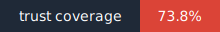
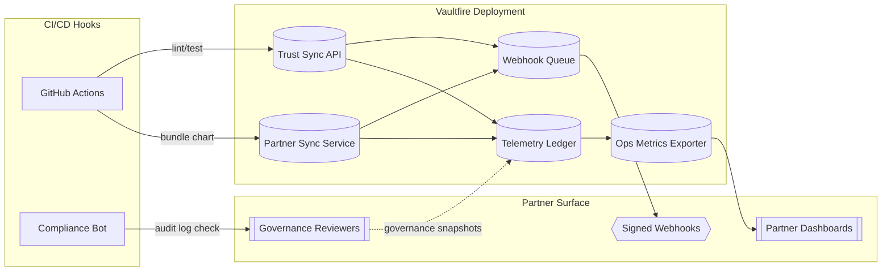

# Vaultfire Protocol 🔥
[](./logs/test-report.json)

[](./docs/badges/trust-badge.svg)
**Belief-secured intelligence for partners who lead with ethics.**

## Project Overview
Vaultfire is a production-ready, morals-first protocol that fuses belief-driven intelligence with verifiable human identity. It orchestrates Codex reasoning engines, NFT-based identity anchors, and partner-focused loyalty modules to deliver a resilient activation stack for ethical AI collaboration.

> **Case Study Reality Check:** All current case study data is modeled from the real behavior loop of Ghostkey-316, the protocol's origin validator and loyalty stress tester. No commercial trials have yet been run beyond this wallet-based pilot layer. Every additional "deployment" or "case study" referenced in this repository is a sandboxed simulation derived from Ghostkey-316 telemetry until further notice.

## Simulated Use Case Pilots (v1)
- **Important:** Every asset linked in this section is a simulation artifact only. Partners must not treat the narratives or metrics as evidence of live deployments.
- [Simulated Community XP Pilot](./sim-pilots/community-xp-pilot.md) — belief-aligned engagement loop showcasing mission dispatch, belief logging, and simulated XP uplift (Simulated Pilot Verified ✅).
- [Simulated Cross-Platform Education Pilot](./sim-pilots/cross-platform-education.md) — NS3 assessment preview with governance mirror rehearsals and device continuity safeguards (Simulated Pilot Verified ✅).
- [Simulated Global Retail Loyalty Flow](./sim-pilots/global-retail-loyalty.md) — streaming rewards engine demonstration with belief multipliers and compliance mirrors (Simulated Pilot Verified ✅).
- [Telemetry & ROI Baseline](./sim-pilots/telemetry-baseline.md) — mocked telemetry dataset and belief-driven ROI projections for partner planning (Simulated Pilot Verified ✅).
- [Partner Kit Bundle](./sim-pilots/partner-kit.md) — consolidated dossier ready for GitHub Wiki publication or PDF export, including roadmap and activation checklist (Simulated Pilot Verified ✅).

Live pilot deployments targeted for Q4 roadmap; current examples demonstrate architectural readiness and CLI flow integrity across simulated environments only, with no live user data or revenue represented.

Partners who want a step-by-step launch plan can review the new [Live Rollout Readiness Blueprint](./docs/live-rollout-readiness.md), which documents the evidence pack, Guardian sign-offs, and telemetry controls required before the production switch flips.

## Trust & Transparency
- **Automated proof:** `npm test` now runs Jest with full coverage, React Testing Library checks, and CLI integrations. Snapshot artifacts are uploaded on every CI run.
- **Security posture:** Express surfaces Helmet headers, safe-list CORS defaults, and SSRF-hardened webhook validation alongside regression tests for invalid JWT and malformed wallet payloads.
- **Telemetry ethics:** Wallet-level consent toggles route opt-in signals to Sentry, logging dashboard renders, wallet logins, and belief vote casts only when explicitly approved.
- **Sink verification:** `npm run telemetry:verify` hashes the live telemetry probes defined in `telemetry/sinks/` and fails fast if a downstream checksum or signature drifts from the approved baseline.
- **Trust badge:** The coverage-driven badge above is auto-generated from `coverage/coverage-summary.json` via `node tools/generateCoverageBadge.js` after each test run.

## Scale Readiness Automation
- **Guardian attestations on demand:** `./vaultfire_system_ready.py --attest guardian.eth` now provisions mission profiles, runs alignment simulations, and emits an attestation pack under `attestations/` with the digest logged for audit trails.
- **Partner-ready readiness artifact:** `./vaultfire_system_ready.py --report -` streams a JSON summary to stdout (or supply a path to persist it) so partner CI can archive a signed readiness state alongside build logs.
- **Unified scale health snapshot:** `./tools/scale_readiness_report.py --pretty` compiles recent Purposeful Scale decisions, thread coverage, belief-density stats, and attestation freshness into a single JSON payload so partners can gate launches on objective readiness signals.
- **Staleness guards baked in:** The readiness report fails the `scale_ready` flag if approvals drop below 60% or if the last aligned expansion is older than six hours, keeping the protocol’s ethics-first mission central while scaling.
- **Golden environment gate:** `./scripts/check-golden-env.sh` enforces the canonical Node, Python, and CLI versions defined in `configs/golden-environment.json` so scale reviews start with aligned toolchains.

## Yield Insights Pipeline
- **Mission log conversion:** `python scripts/run_yield_pipeline.py` ingests `/missions/pilot_logs/*.json`, strips pilot identifiers, hashes mission IDs with SHA256, and publishes anonymized case studies to `/public/case_studies/` following `schemas/yield_case_study.schema.json`.
- **Public API:** Launch the FastAPI service with `uvicorn yield_pipeline.api:app --reload` and query `/api/yield-insights?segment_id=belief-01`. Responses are rate limited to 30 requests/minute per IP, accept optional `date_range=start,end`, and require the `X-API-Key` header when `YIELD_API_KEY` is set.
- **Repeatable activation modelling:** `python -c "from yield_pipeline.engine import simulate_activation_to_yield; import json; print(json.dumps(simulate_activation_to_yield('pilot-001'), indent=2))"` calculates retention, referral, and time projections, persisting audit-friendly reports in `/yield_reports/`.
- **Attestations:** Every API call writes an anonymized audit record to `/attestations/yield-api-activity.json` so compliance teams can trace public insight access.
- **Dashboard:** `streamlit run dashboard/yield_dashboard.py` renders belief-segment filters, ROI visualizations, and mission drilldowns sourced from the published case studies for transparent partner storytelling.

## Enterprise Bridge Enhancements (Resolved)
- **Live adoption status:** `/deployment/status` and `/deployment/mode` expose a simulated/live toggle with a green-dot `LIVE` indicator, real-time telemetry ingestion (`POST /telemetry/realtime`), and onchain-ready signature logging (`POST /belief/actions/sign`). Partners can explore the view through the new `/trust-map` endpoint or the `cli/belief-mapper.js --map` CLI.
- **Financial model clarity:** Rewards now surface hybrid-compliance posture, reputation-to-yield conversions, and partner revenue bridge previews directly from `/vaultfire/rewards/:walletId`. Config schemas accept `vaultfire.partnerReady`, deployment profiles, and partner revenue templates so governance votes can unlock real payouts on demand.
- **Integration complexity:** The interpreter module converts belief jargon into enterprise tags, the trust map endpoint powers dashboards, and conservative deployment presets live under `deployment/sample-suite/` to disable advanced semantics until explicitly enabled. Run `node cli/belief-mapper.js --term multipliers` for instant mapping.

> Sample manifests in `deployment/sample-suite/` codify both simulated and live-ready launches, ensuring partner-ready deployments flip `vaultfire.partnerReady = true` and enable the bridge features automatically.

## Cutting-Edge Mission Resonance Layer
- **Mission locked to the covenant:** `MISSION_STATEMENT` now ships from [`vaultfire/protocol/constants.py`](./vaultfire/protocol/constants.py) so every new module references the canonical mission text before processing partner data.
- **Signal fusion with privacy tech:** [`MissionResonanceEngine`](./vaultfire/protocol/mission_resonance.py) blends edge-LLM embeddings, FHE streams, ZK Fog redactions, MPC council updates, and neural-symbolic evaluators while keeping loyalty scores inside encrypted envelopes.
- **Post-quantum attestations:** The companion [`PostQuantumSignatureVerifier`](./vaultfire/protocol/mission_resonance.py) issues Dilithium-style hashes so partner dashboards can accept lattice-strength mission confirmations without leaking plaintext content.
- **Integrity snapshot for partners:** `MissionResonanceEngine.integrity_report()` exports a readiness digest (mission, blended resonance index, technique mix, and threshold check) that compliance teams can sign before a new cohort goes live.
- **Confidential compute verification:** `ConfidentialComputeAttestor` pairs with `MissionResonanceEngine` so confidential-ML enclaves deliver remote-attested signals without exposing model weights or contributor telemetry.
- **Real-time gradient telemetry:** `MissionResonanceEngine.resonance_gradient()` and `technique_breakdown()` surface time-based resonance deltas and per-technique averages, helping stewards catch mission drift before it impacts the covenant.
- **Stealth pilot visibility:** [`PilotResonanceTelemetry`](./vaultfire/pilot_mode/resonance.py) feeds confidential-ML signals from pilot sessions into the ledger with gradient breakdowns and attested enclave manifests for private dashboards.

## Mission Covenant Chain (Foundational)
- **Exclusive to Vaultfire:** The new `MissionCovenantLedger` forges an unstoppable covenant hash chain that no other protocol ships, binding every partner action to the canonical mission without drift.
- **Anchor-first issuance:** Covenants can only mint after a Mission Continuity Anchor is registered, so expansions inherit the ethics-locked lineage before scaling.
- **Auditable exports:** Each covenant exports mission lineage, metadata, and unstoppable proof digests so partners can independently verify covenant integrity without revealing private payloads.

## Installation
1. Clone this repository and install dependencies: `npm install`
2. Launch the wallet-only Partner Sync interface: `node partnerSync.js`
3. Run the Vaultfire Dashboard for a futuristic dark-mode UI: `npm run dashboard:dev`
4. Execute the Codex Integrity tests to verify belief discipline: `npm test`

All modules are wallet-first. No email capture, no digital ID fallback—ever.

Optional Sentry front-end hooks are detected during `npm install`. If `@sentry/react` is not present, the postinstall script logs
guidance and Jest falls back to an identity profiler so mobile pipelines keep passing.

## 🏁 Onboarding Test Checklist
- Review the [Operational Onboarding Checklist](./docs/runbooks/onboarding-test-checklist.md) before inviting new partners.
- Run `node scripts/run-test-suite.js` to execute module-by-module coverage checks and surface any gaps below 80%.
- Capture generated artefacts (coverage reports and `logs/test-report.json`) for compliance sign-off.
- Archive live readiness artefacts with `python scripts/collect-live-evidence.py` once the Guardian Council signs the production bundle.

## Due Diligence & Maturity Signals
- Review the [Technical Due Diligence](./docs/technical-due-diligence.md) brief for architecture, threat modeling, and dependency health snapshots.
- Monitor uptime trends and reference deployments via the [Operational Metrics](./status/metrics.md), [Reference Deployments](./status/reference-deployments.md), and [Security Report](./status/security-report.md) rollups.
- Track change governance through the [Change Management Playbook](./docs/change-management.md) and automated checks in [`scripts/security-audit.sh`](./scripts/security-audit.sh).
- Bundle audit receipts via `scripts/collect-live-evidence.py` so partners receive a signed digest (recorded in `immutable_log.jsonl`) for their compliance teams.
- Vaultfire maintains transparent partner communications, surfacing scan results, scheduled audits, and rollout notices before each production pilot.
- When referencing the [Reference Deployments](./status/reference-deployments.md) rollup or any partner-facing summaries, remember that only the Ghostkey-316 wallet pilot has been executed live; all other deployments remain simulations based on that source telemetry.

## Module Scope Modes

Vaultfire ships with a scoped loader for pilot programmes. Set `VAULTFIRE_MODULE_SCOPE` in your environment (or `.env`) and run
`node pilot-loader.js` to verify which modules will initialise.

| Scope | Modules Enabled |
| --- | --- |
| `pilot` | CLI, Dashboard, Belief Engine |
| `full` | All (incl. APIs, Telemetry, Gov) |

When `pilot_mode=true` in the environment the loader automatically falls back to the `pilot` scope for minimal rollouts.

## 📱 Mobile Compatibility

- Residency guard automatically adapts to React Native and webview runtimes without blocking bundle execution.
- Optional telemetry exports are disabled when `MOBILE_MODE` is active to preserve bandwidth and partner privacy.
- CLI-heavy flows (preflight, residency drills) auto-skip when a mobile environment is detected, keeping developer ergonomics intact on phones and tablets.
- Run `MOBILE_MODE=true npm run preflight` for a compact status readout before revisiting the full desktop checks.

## Testing Playbook

| Command | Purpose |
| --- | --- |
| `npm test` | Executes the full Jest suite with coverage, regenerating the coverage badge. |
| `MOBILE_MODE=true npm test` | Re-runs the suite with mobile relaxations enabled to confirm residency and telemetry guards short-circuit safely. |
| `npm run preflight` | Validates peer dependencies, Node.js version, and residency configuration with full desktop formatting. |
| `MOBILE_MODE=true npm run preflight` | Emits the mobile-friendly summary so you can verify posture quickly on tablets/phones. |

## How to Launch a Scoped Partner Pilot
1. **Initialize sandbox mode:** export `VAULTFIRE_SANDBOX_MODE=1` before starting the Partner Sync interface so belief and loyalty engines log sandbox metrics to `logs/belief-sandbox.json`.
2. **Enable telemetry privacy controls:** update `configs/deployment/telemetry.yaml` if partners require telemetry opt-outs—set `telemetry.enabled` to `false` for no-stream pilots.
3. **Deploy pilot configs:** run `node cli/deployVaultfire.js --env sandbox` to apply the `pilot_ready: true` deployment manifests across handshake, relay, reward-streams, and telemetry services.
4. **Verify manifest metadata:** call `GET /status` on the running Partner Sync interface; confirm the response includes `manifest.semanticVersion`, `ethics.tags`, and `scope.tags` aligned with your pilot scope.
5. **Share pilot brief:** point partners to the `VERSION.md` changelog, the `/debug/belief-sandbox` endpoint output, and the README badge for the latest verified test run before inviting wallet-based contributors.

## Pilot Integration Timeline

| Phase | Window | Partner Checklist |
| --- | --- | --- |
| Discovery Sync | Week 0 | Confirm wallet-based access, review `manifest.json` ethics tags, and capture governance contacts. |
| Sandbox Validation | Week 1 | Enable `logs/belief-sandbox.json`, call `GET /debug/belief-sandbox`, and verify telemetry fallbacks through the dashboard API. |
| Governance Review | Week 2 | Share `governance_plan.md`, execute `npm test` with the generated `/logs/test-report.json`, and archive the latest `CHANGELOG.md` entry. |
| Pilot Launch | Week 3 | Flip deployment YAMLs with `pilot_ready: true`, execute webhook rehearsal via SecureStore fallback, and distribute the due diligence quickstart. |

## System Diagram
```
┌────────────────────────┐         ┌─────────────────────────────┐
│ Wallet / ENS Identity │─belief─▶│ Partner Sync Interface (API) │
└────────────────────────┘         │  • POST /vaultfire/sync-belief│
                                   │  • GET  /vaultfire/sync-status│
                                   └──────────────┬────────────────┘
                                                  │ real-time socket
                                                  ▼
                                   ┌─────────────────────────────┐
                                   │ Belief Mirror v1 (AI Engine)│
                                   │  • computes multipliers      │
                                   │  • writes telemetry logs     │
                                   └──────────────┬──────────────┘
                                                  │
                                                  ▼
                                   ┌─────────────────────────────┐
                                   │ BeliefVote CLI              │
                                   │  • wallet-signed votes      │
                                   │  • belief-weighted outputs  │
                                   └──────────────┬──────────────┘
                                                  │
                                                  ▼
                                   ┌─────────────────────────────┐
                                   │ Vaultfire Dashboard v1      │
                                   │  • WalletConnect / ENS login│
                                   │  • belief score + history   │
                                   └──────────────┬──────────────┘
                                                  │
                                                  ▼
                                   ┌─────────────────────────────┐
                                   │ Codex Integrity Test Suite  │
                                   │  • audits for alignment     │
                                   └─────────────────────────────┘
```

## Quick Infra Model



- **Terraform**: `infra/mvd.tf` provisions an AWS Fargate baseline (VPC, load balancer, task definitions, secrets) for the Trust Sync API and Partner Sync services.
- **Helm (optional)**: `charts/vaultfire/` packages the same services plus a metrics Service and ServiceMonitor for Kubernetes clusters.
- **CI/CD Hooks**: GitHub Actions trigger container builds, Terraform plans, Helm releases, and validate `governance/auditLog.json` updates before production rollouts.
- **Metrics Fan-out**: The shared Ops Metrics exporter feeds `/metrics/ops` while structured telemetry continues to stream through `MultiTierTelemetryLedger` sinks.

## Deployment Guide

The `deployment/` folder contains a minimal Terraform configuration (`vaultfire-minimal.tf`) and a CI-friendly diagram (`deployment-diagram.md`). Use these assets to bootstrap a pilot environment that mirrors production guardrails without requiring the full `infra/` stack.

1. **Plan & Apply:** Run `terraform init` and `terraform plan` inside `deployment/` to review AWS primitives (artifact bucket and webhook secret).
2. **Bundle Promotion:** Point CI outputs to the `artifact_bucket` output so release bundles land in the managed S3 store before ECS pulls them.
3. **Secret Rotation:** Maintain webhook secrets in SSM via `webhook_secret_path` and rotate them using existing automation hooks in `tools/`.
4. **Diagram Review:** Reference `deployment/deployment-diagram.md` to align DevOps, SRE, and partner teams on the minimum viable deployment topology.

Automation touchpoints remain unchanged: GitHub Actions runs tests (`.github/workflows/test.yml`), the CLI promotes artifacts, and Terraform tracks state for auditability.

## Module Guide

### 📦 Partner Sync Interface (`partnerSync.js`)
- Signature-locked Express API exposing `/vaultfire/sync-belief` (POST) and `/vaultfire/sync-status` (GET).
- Socket.IO broadcasts and webhook fan-out keep partners aligned in real time.
- Stores sync multipliers in-memory while mirroring every belief action to telemetry.
- Start with `node partnerSync.js` or embed via `createPartnerSyncServer()`.
- Enterprise-grade manifest failover (`services/manifestFailover.js`) keeps `/status` and `/manifest.json` authoritative even if `manifest.json` is rotated or temporarily unavailable.

### 🧠 Belief Mirror v1 (`mirror/engine.js` + `mirror/belief-weight.js`)
- Ingests quiz scores, holding patterns, votes, and partner syncs to compute belief multipliers.
- Telemetry recorded in `telemetry/belief-log.json` for downstream analytics.
- Streams belief telemetry to optional sinks (S3, Firehose, or custom handlers) for durable storage.
- Schedule hourly runs or trigger via CLI by importing `BeliefMirrorEngine`.

### 🗳 BeliefVote CLI (`cli/beliefVote.js`)
- `vaultfire vote --proposal <id> --choice <a|b|c> --wallet <addr> --signature <sig> --message <msg>`
- Verifies wallet signatures, references `proposals.json`, and appends weighted outcomes to `votes.json`.
- Auto-updates belief telemetry so governance behavior influences multipliers.

### 🖥 Vaultfire Dashboard v1 (`dashboard/`)
- Dark-mode React UI with wallet or ENS login plus optional browser wallet signature flow.
- Surfaces personal multiplier, tier, partner sync stream, mirror reflections, and BeliefVote history.
- Consumes the Partner Sync API securely and subscribes to Socket.IO for live updates.

## 📦 Streaming Rewards Roadmap
- Prototype contract: [`contracts/RewardStream.sol`](./contracts/RewardStream.sol) – manages multiplier updates for future streaming payouts.
- Integration interface: [`src/rewards/contractInterface.js`](./src/rewards/contractInterface.js) – simulates RPC calls until the chain deployment is finalized.
- Roadmap reference: [`docs/gamified_yield_layer.md`](./docs/gamified_yield_layer.md) – outlines the loyalty mechanics the stream will eventually power.
- Treasury vault orchestration and automated multiplier settlements are handled by the reward stream planner and documented in
  [`docs/rewards.md`](./docs/rewards.md).

### 🧪 Codex Integrity Test Suite (`tests/integrity.test.js`)
- Jest-powered guardrails validating wallet-only identity, mirror math, CLI vote flow, and dashboard truth.
- Emits `codex-integrity.json` with pass/fail metadata after each run for audit trails.

### 🛰 Tenant Telemetry Router (`services/telemetryTenantRouter.js`)
- Segregates telemetry ledgers per partner tenant, eliminating cross-tenant data mixing.
- Supports concurrent fan-out with `flushAll()` to drain sinks after burst loads.
- Backed by Jest coverage in `tests/telemetryTenantRouter.test.js` simulating 75 concurrent partner events.

### 🛡 Manifest Failover Service (`services/manifestFailover.js`)
- Watches `manifest.json` for rotations or outages and falls back to safe defaults automatically.
- Emits structured telemetry (`manifest.failover.*`) so governance teams see when fallbacks engage or recover.
- Shared across `/status` and `/manifest.json` ensuring partner integrations remain deterministic.

### 🚀 Enterprise Mission Control (`vaultfire/enterprise/mission_control.py`)
- Runs Purposeful Scale authorization before any enterprise expansion to keep the mission intact.
- Ships belief-weighted checklists for ethics, telemetry trust fabric, and resilience squad readiness.
- Generates audit-ready blueprints and logs every decision to `logs/enterprise/mission_control.json`.

## Telemetry Residency & Partner Hooks

- Configure residency policies in `vaultfirerc.json` (or via `VAULTFIRE_RC_PATH`) and enable the JSON fallback flag (`"telemetry-fallback": true`) so remote sink failures are mirrored locally.
- Residency guardrails are enforced at runtime: every Sentry DSN or partner webhook must match the allow-list declared in `trustSync.telemetry.residency`. `npm run preflight` now fails fast if your region map is incomplete so pilots cannot ship without jurisdictional coverage.
- The Trust Sync loader now normalises fallback preferences so every `MultiTierTelemetryLedger` instance mirrors failed remote writes into `logs/telemetry/remote-fallback.jsonl` for compliance review.
- Extend telemetry pipelines by wiring the partner hook adapter:

  ```js
  const partnerHook = require('./telemetry/adapters/partner_hook_adapter');

  partnerHook.init('https://partners.example.com/hooks/telemetry');
  await partnerHook.writeTelemetry({ event: 'belief.signal', payload: { wallet: '0xabc' } });
  ```

  Swap the URL for region-specific endpoints to respect data residency constraints while still tapping into Vaultfire's belief events.

**Final Rule: Wallet is passport. Vaultfire never compromises.**

## Core Features
- **Codex-Aligned Intelligence:** Continuous alignment loop that feeds signal, ethics, and activation data directly into the Codex layer.
- **Identity-Linked NFTs:** Verifiable Vaultfire NFT IDs ensure partner provenance and enforce lineage-aware access control.
- **Vaultfire CLI Suite:** Cross-platform command-line utilities for deployments, audits, and activation beacons, including the
  `vaultfire-deploy` planner for sandbox and production rollouts.
- **Belief Signal Engine:** Loyalty-aware scoring and ambient signal synthesis for responsive reward flows.
- **Partner Integration Sandbox:** Ready-to-run activation demos, forks, and API shims for rapid onboarding.
- **SecureStore Guardrails:** Encryption-backed storage protecting belief logs, partner credentials, and ethics artifacts.
- **Partner Confidence Mechanics:** Hardened webhook delivery with signed callbacks, backoff queues, and telemetry sinks underpin pilot-ready onboarding.

## Delivery Resilience & Scaling Milestones
- **Signed Callbacks:** All partner webhooks now include Vaultfire HMAC signatures and delivery identifiers.
- **Queue-Based Delivery:** Automatic retries with exponential backoff and dead-letter surfacing keep integrations stable under load.
- **Telemetry Durability:** JSON telemetry can be mirrored to remote sinks for HIPAA/SOC 2/GDPR evidence without sacrificing local archives.
- **Scaling Playbook:** `services/scalingPlaybook.js` evaluates delivery resilience, scaling pathways, and security controls to prioritise partner polish work.
- **Governance Automation:** `governance/automation_triggers.py` raises guardrail actions when queues spike, security alerts occur, or ethics overrides need steward review.
- **Tenant-Isolated Telemetry:** `services/telemetryTenantRouter.js` provides per-tenant log segregation with bulk flush support so multi-tenant activations never co-mingle belief data.
- **Manifest Failover Watchdog:** `services/manifestFailover.js` automatically falls back to safe defaults, emits audit telemetry, and self-heals once canonical manifests return.

## Governance and Risk

Vaultfire records critical governance decisions in [`governance-ledger.json`](./governance-ledger.json) and documents the update workflow in [`governance/README.md`](./governance/README.md). Use these resources to confirm threshold changes, partner onboarding approvals, and infrastructure updates before promoting releases.

- **Audit Trail:** Append ledger entries via pull requests and validate them with `npm run audit:gov`.
- **Operational Links:** Cross-reference ledger changes with posture rotation logs and telemetry metrics described in [`docs/metrics.md`](./docs/metrics.md).
- **Risk Reviews:** Include ledger excerpts in partner due diligence packets to evidence compliance and rollback planning.

## System Architecture
Vaultfire combines an ethics-weighted Codex integration, an NFT ID registry, and a multi-tier CLI to coordinate protocol state. The system syncs belief telemetry, loyalty scores, and Codex outputs through Ghostkey-316 anchors while exposing partner modules, SDK hooks, and fork-ready governance controls for seamless expansion.

## Status
- **Activation:** Complete and operational across the Vaultfire network.
- **Versioning:** Semantic versioning tracked in [`VERSION.md`](./VERSION.md) and surfaced through `manifest.json`.
- **Stability:** Production-hardened with live partner integrations and continuous monitoring.

## Changelog
- **v1.4.0 (2024-09-12):** Added sandbox metrics logging, manifest metadata in status responses, telemetry safeguards, and pilot-ready deployment toggles. Full details are available in [`VERSION.md`](./VERSION.md).

## Contributor Identity
- **Architect:** Ghostkey-316
- **ENS:** `ghostkey316.eth`
- **Primary Wallet:** `bpow20.cb.id`

## Ethics Framework
Vaultfire Ethics v2.0 governs every deployment with morals-before-metrics safeguards, consent-bound data practices, transparent accountability logs, and mandatory lineage preservation for all forks and partner activations.

## Optional Enhancements
- Retroactive yield streams for belief-aligned contributors.
- Partner fork pathways governed by the Moral Memory Fork Agreement.
- Codex clone packages for sanctioned secondary deployments.

## Licensing & Legal
Vaultfire is released under a morals-first framework that permits fair-use collaboration, prohibits exploitative or extractive deployments, and requires all operators to preserve ethics alignment, attribution, and user consent. This repository provides no medical, legal, or financial advice; partners must complete their own compliance reviews prior to launch.

## Contact & Integration
Prospective partners can initiate integration by opening a secure channel via the partner onboarding toolkit, scheduling a Codex handshake session, or contacting Ghostkey-316 through verified ENS or wallet messaging. Integration support includes activation workshops, SDK walkthroughs, and ethics alignment audits.

---
**Architect:** Ghostkey-316 · Vaultfire Protocol Steward

## Partner Integration Modules · Real-World Activation Phase

The 2024 integration expansion introduces a full-stack activation path that prioritises belief-signal fidelity and ethics-first guardrails. Every module is forkable and tuned for partner extensibility.

### 🔐 Authentication Layer (`/auth`)
- `tokenService.js` issues JWT access tokens with embedded role + belief metadata and maintains refresh token rotation.
- `authMiddleware.js` provides plug-and-play Express middleware with rate limiting, expiry handling, and RBAC filters for `admin`, `partner`, and `contributor` personas.
- `expressExample.js` exposes sample login, refresh, rewards, and belief mirror routes plus a live Swagger UI at `/docs`.
- **Run locally:** `npm run start:api`

### 🧠 Ethics Protocol Guardrails (`/middleware`)
- `ethicsGuard.js` logs intent metadata (user type, endpoint, reason flag, purpose) to `logs/ethics-guard.log` and enforces block/warn policies.
- Partners extend guardrails by copying `middleware/guardrail-policy.json` or pointing middleware to a custom policy file.
- Automation spikes trigger warnings or hard stops aligned with the Vaultfire ethics doctrine.

### 🧩 Partner Onboarding Kit (`/cli`)
- `vaultfire-cli` streamlines partner setup with:
  - `vaultfire init` → scaffolds `vaultfire.partner.config.json` and belief templates.
  - `vaultfire test` → pings the `/health` endpoint to verify connectivity + auth readiness.
  - `vaultfire push` → submits belief telemetry to `/vaultfire/mirror` using live tokens. Pass `--beliefproof` to emit an ENS-signed integrity hash for the submission.
  - `vaultfire trust-sync` → verifies Trust Sync maturity, reporting fingerprinted timelines and uptime multipliers.
- Install globally via `npm install` then `npx vaultfire init`, or invoke locally with `node cli/vaultfire-cli.js <command>`.

### 🌐 Partner Dashboard UI (`/dashboard`)
- React + Vite implementation with JWT-gated access, yield metrics, and belief telemetry visualisations.
- Authenticated views call the same sample API used by the CLI to keep flows consistent.
- **Develop:** `npm run dashboard:dev`
- **Build static assets:** `npm run dashboard:build`

### 🧾 OpenAPI & Compliance Artifacts
- `docs/vaultfire-openapi.yaml` mirrors every endpoint described in `vaultfire-partner-docs/docs/api-reference.md` with tags, scopes, and example payloads. Served automatically via `/docs` when running the sample API.
- `vaultfire-sla.json` captures uptime, response SLAs, and ethics obligations for partner agreements.
- `vaultfire-compliance-template.json` provides a ready-to-complete checklist for privacy, automation thresholds, and opt-in telemetry.

### ✅ Testing & Coverage
- Jest suites in `/tests` exercise the authentication flow, guardrail middleware, and CLI scaffolding.
- Run `npm test` for fast feedback or `npm run test:coverage` for full instrumentation.
- All suites reinforce belief-centric metadata and ethics guardrails to prevent regressions.
