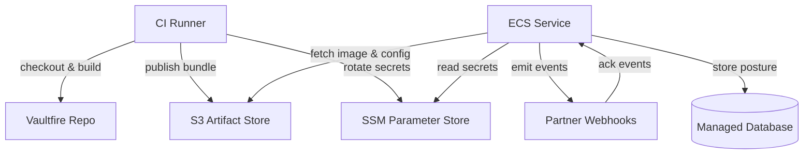

# Vaultfire Minimum Viable Deployment

Minimal automation links CI output to AWS primitives, ensuring webhook secrets stay in SSM and deployable bundles land in the artifact bucket defined in `vaultfire-minimal.tf`.
