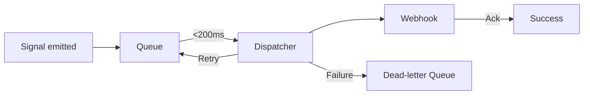

<!--
NON-NORMATIVE DOCUMENT

This file is historical/legacy/audit material and may contain aspirational language.
The canonical, current claims & limits are in: docs/CLAIMS_AND_LIMITS.md
-->

# Operational Metrics Overview

Vaultfire's production readiness depends on consistent visibility into webhook throughput, posture rotation integrity, and telemetry health. This document outlines the minimum set of signals that should be wired into observability dashboards before going live.

## Webhook Delivery Metrics
- **End-to-end latency (p95/p99):** Track the duration from event emission to partner acknowledgment. Alerts should trigger when p95 exceeds 2s or p99 exceeds 5s.
- **Retry volume:** Count of automatic retries over time. Anomaly detection should fire if retries spike 50% above the seven-day baseline.
- **Dead-letter queue (DLQ) entries:** Any webhook that exhausts retries must enter the DLQ with payload fingerprinting for rapid triage.



## Posture Rotation Audit Logs
- **Rotation timestamp:** Every rotation writes an immutable log with operator, posture hash, and justification reference.
- **Approval quorum:** Record which reviewers approved the rotation and ensure quorum thresholds remain intact.
- **Drift detection:** Highlight deviations between expected posture manifests and the deployed configuration within 5 minutes.

### Sample Log Entry
```
2024-05-12T18:42:11Z posture-rotation rotation_id=rot-2217 actor=automation@vaultfire justification=weekly-hardening
  approvals=["secops@vaultfire","compliance@vaultfire","sre@vaultfire"]
  posture_hash=b9129f75
  drift_delta=0
```

## Telemetry Queue Depth
- **In-flight message count:** Monitor queue depth per telemetry stream. Issue warnings at 5,000 and critical alerts at 10,000 pending messages.
- **Processing rate:** Compare producers vs consumers to anticipate backpressure before it reaches critical levels.
- **Burst scenarios:** Simulate spikes (e.g., 5x load during partner promotion) and confirm auto-scaling drains backlog within 10 minutes.

### Example Depth Table
| Queue | Healthy Range | Warning | Critical |
|-------|---------------|---------|----------|
| `telemetry-signals` | 0 - 2,500 | 2,501 - 4,999 | >= 5,000 |
| `telemetry-ingest` | 0 - 4,000 | 4,001 - 7,999 | >= 8,000 |
| `telemetry-export` | 0 - 1,500 | 1,501 - 2,999 | >= 3,000 |

Ensure dashboards pair these thresholds with incident runbooks that include escalation paths, rollback steps, and partner communication templates.
